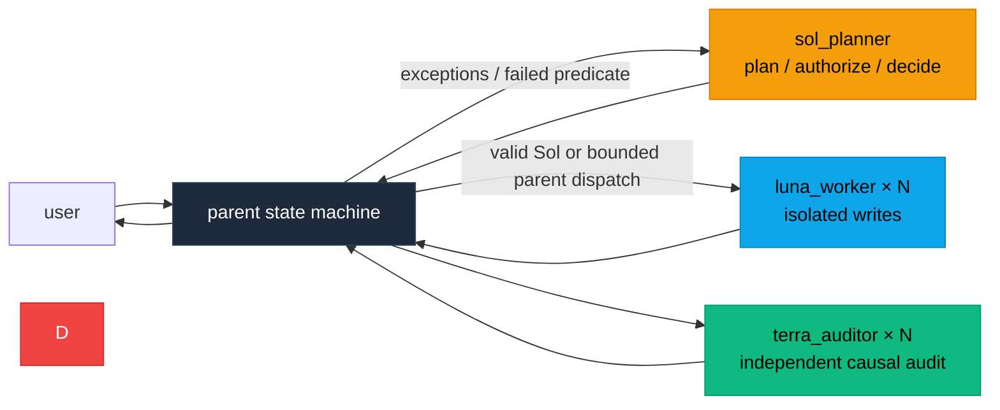
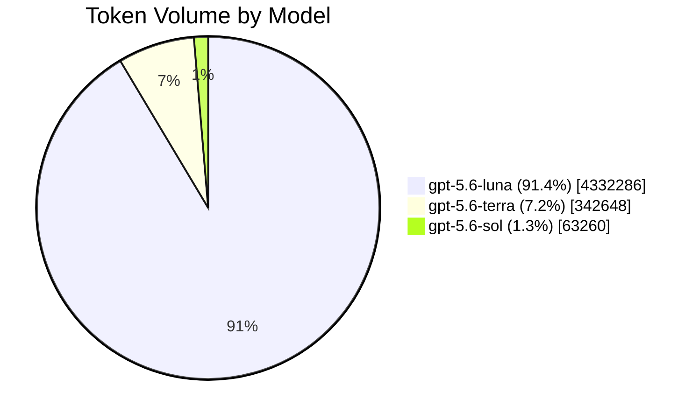

<br/>

<p align="center">
  <a href="https://zread.ai/GhostXia/lean-dev-router" target="_blank" rel="noopener noreferrer"></a>
</p>

<h1 align="center">
  <sub>⚡</sub> Lean Dev Router <sub>⚡</sub>
</h1>

<p align="center">
  <strong>Software engineering routing that puts each agent in the right role</strong>
</p>

<p align="center">
  <em>Runtime-independent · Escalate on demand · Token-efficient</em>
</p>

<p align="center">
  <a href="#-english">English</a>
  <span>&nbsp;·&nbsp;</span>
  <a href="docs/zh-CN/README.md">Chinese documentation</a>
</p>

---

## 🌟 Core Highlights

> **Token-efficient** — Reduce unnecessary agent calls and handoff context.
> **Role-separated** — Sol plans, Luna implements, and Terra validates.
> **Protocol-driven** — Compact, auditable `lean-dev-router/v2` handoffs.
> **Isolated parallelism** — Every writing Luna owns a separate worktree or checkout.
> **Runtime-independent** — The routing theory is portable beyond Codex and GPT.

---

## 🇬🇧 English

> The directly executable runtime under `.agents/` and `agents/` is English-only and is the single source of truth. [Chinese documentation](docs/zh-CN/README.md) is maintained separately for human readers and is never assembled into agent runtime context.

### 📖 Overview

**Lean Dev Router** is a general theory for coordinating and escalating repository-bound software engineering lifecycle work. It assigns planning, implementation, diagnosis, and validation to agents with different responsibilities and cost levels, escalating only when necessary.

The published runtime has exactly three child profiles: `luna_worker` (`gpt-5.6-luna`, max), `sol_planner` (`gpt-5.6-sol`, medium), and read-only `terra_auditor` (`gpt-5.6-terra`, high). The parent is the default scheduler and user-facing control surface; for the conditional fast path its host model must also be Terra High. The parent is not a fourth Agent/profile.

I currently use Codex, so this repository uses GPT model identifiers as concrete examples. The routing theory is not tied to Codex or GPT and can be adapted to other agent runtimes and models.

For further token savings, this router can be combined with projects such as [Caveman](https://github.com/juliusbrussee/caveman), which reduce unnecessary verbosity in engineering workflows. **Lean Dev Router** reduces unnecessary agent calls and handoff context; **Caveman** reduces unnecessary prose in agent responses. Together, they can help maximize token efficiency while preserving the technical content that matters. This project currently does not plan to duplicate response-compression features already provided by such projects.

Because the subagents use explicitly selected models and bounded assignments, the parent does not need to be the most expensive planning model. **Sol** owns exception planning and ordinary write authorization, while the parent conversation is the scheduler and user-facing control surface. A qualifying Terra High parent may also issue one strictly bounded L1/L2 dispatch under the fast-path predicate below. Sol is called again at a declared expansion or exception gate.

#### Recommended parent model

For the bounded parent fast path, use a balanced mid-tier model such as `gpt-5.6-terra` with **high reasoning effort**. “Mid-tier model” and “high reasoning effort” describe different choices: the model family sets the general capability/cost tier, while reasoning effort controls how much inference that model spends on the current turn. The recommended compromise is therefore **Terra High**, not a weak model with a large prompt and not Sol acting as the always-on parent.

This choice gives the parent enough semantic ability to normalize user intent, detect missing or contradictory evidence, avoid lossy restatement, select the correct declared route, and close an eligible low-risk task without first paying for a Sol planning call. It still keeps architecture, scope expansion, risk acceptance, compatibility decisions, multi-batch integration, and other exception work on Sol. Using Sol as the parent would usually spend Sol-priced tokens on waiting, queue management, telemetry handling, and routine forwarding; using a weaker parent for the fast path increases the chance of an incorrect eligibility decision or malformed dispatch.

The recommended capability split is:

| Parent configuration | Allowed responsibility | Bounded dispatch capability |
|:---|:---|:---|
| Weaker or lower-cost model | Relay an already fixed contract, wait, queue, display results, and apply deterministic destination rules | **Disabled**; it must route any task requiring interpretation to Sol |
| `gpt-5.6-terra` with high reasoning effort | All mechanical scheduling plus semantic eligibility checks, faithful contract normalization, and one strict L1/L2 batch | **Enabled** only when every fast-path predicate and reduced budget passes |
| `gpt-5.6-sol` as parent | Technically capable, but not the recommended steady-state configuration | Avoid as the default; invoke Sol as a child only at declared planning or exception gates |

Terra High parent authority is deliberately narrow. It may choose among routes already defined by the protocol and may author the one bounded packet described below; it may not invent acceptance criteria, widen paths, resolve architecture or policy trade-offs, suppress a risk flag, reinterpret a failed predicate as “close enough,” write code, or perform its own final audit. If eligibility is uncertain, the correct outcome is `parent:sol`, not a best-effort Luna call.

Model identity and reasoning effort are host configuration. The repository validator and runtime guard can verify the packet, budget, identity separation, and routing evidence, but they cannot prove which model the host actually assigned to the parent. Operators must configure Terra High outside the repository. When evaluating another model family, keep the same authority boundary and compare it with controlled A/B runs using wrong-route rate, malformed or rejected dispatches, unnecessary Sol calls, repair cycles, model-active time, and total uncached tokens—not token count alone.

### 🧭 Engineering Lifecycle Entry Points

| Work Type | Default Route |
|:---|:---|
| 🔧 Bounded implementation, fixes, refactors, tests, docs, config | A qualifying Terra High **parent** may issue one strict L1/L2 `DISPATCH`; otherwise **Sol** issues the dispatch and handles planning/decomposition |
| 🔍 Audits, reviews, compliance checks, or release readiness | One or more **Terra** workers first; **Sol** partitions or consolidates when needed; **Luna** handles only authorized remediation |
| 🐛 Investigations, incidents, performance analysis, debugging | **Terra** establishes evidence and likely causes; **Sol** resolves in-scope technical trade-offs or returns user-owned choices; **Luna** applies the authorized fix |
| 🔄 Migrations, dependency upgrades, or platform upgrades | **Sol** plans within scope & defines order; **Terra** inventories compatibility & risk; isolated **Luna** worktrees implement; **Terra** verifies |
| 👑 Major direction, scope, policy, or irreversible commitments | **Sol** may frame options, but the parent returns the decision to the user |

> ⚠️ This expansion covers **repository-bound engineering work only**. It does not grant authority for production deployment, destructive operations, external commitments, or changes to business/product policy **without explicit user approval**.

### 📡 Dispatch and Handoff Protocol

Execution authority is a distinct inbound contract. Luna must receive this complete artifact before any implementation tool or write:

```text
PROTOCOL: lean-dev-router/v2
STATUS: DISPATCH
TARGET: implementation
DISPATCH_ID: stable unique component/write identifier
PLAN_ID: stable plan identifier
PLANNER_ROLE: sol_planner | parent
PLANNER_CAPABILITY: bounded_l1_l2_dispatch (parent fast path only)
PLANNER_INSTANCE_ID: immutable planner or parent instance identifier
AUDITOR_INSTANCE_ID: independent terra_auditor instance identifier
TASK_SUMMARY: one bounded objective
BASELINE: commit hash
PATHS_ALLOW:
- relative/path/or/subtree
ACCEPTANCE:
- objective check and expected result
CONSTRAINTS:
- fixed implementation or compatibility bound
BUDGET:
  MODEL_CALL_LIMIT: positive integer
  HYPOTHESIS_LIMIT: positive integer
  MODEL_ACTIVE_SECONDS_LIMIT: positive integer
  REPAIR_CYCLE_LIMIT: positive integer
  STAGNANT_CALL_LIMIT: positive integer
NEXT: parent
```

Sol authors or amends ordinary `DISPATCH` packets. A Terra High parent may author exactly one packet only with `PLANNER_ROLE: parent`, `PLANNER_CAPABILITY: bounded_l1_l2_dispatch`, and all fast-path evidence below; it cannot amend a Sol packet or relax the predicate. These packet fields are eligibility claims, not authorization proof: the host must also pass `--trusted-parent-instance-id <id> --trusted-parent-model gpt-5.6-terra --trusted-parent-reasoning-effort high` to runtime guard outside the packet. The identity must match `PLANNER_INSTANCE_ID`, and the trusted context must be Terra High. Missing fields, an absent or mismatched trusted binding, non-relative write paths, open major decisions, or other ineligible evidence make the packet invalid; the guard routes `parent:sol` before Luna is spawned. A defensively mis-invoked Luna performs no inspection or write and returns `BLOCKED/none` to `parent:pause`.

`PLANNER_CAPABILITY` is conditional: omit it from ordinary Sol packets so existing v2 dispatches remain compatible. Parent packets additionally carry the explicit eligibility fields named under [Parent Fast Path](#-parent-fast-path); these narrow authorization and do not create a new protocol version.

Inbound `DISPATCH` does not include `AGENT`. When an L1 task has no narrower constraint, use a concrete minimal entry such as `minimal change only` rather than leaving `CONSTRAINTS` empty. Workers request capabilities rather than naming peers; the parent performs a deterministic role-and-request lookup without interpreting the evidence.

All three roles use a separate compact outbound result protocol:

```text
PROTOCOL: lean-dev-router/v2
AGENT: luna_worker | terra_auditor | sol_planner
STATUS: PASS | BLOCKED | ESCALATE
FAILURE: none | missing_dispatch | scope | verification | dependency | ambiguity | major-decision
REQUEST: none | implementation | technical_resolution | planning_resolution | human_authority
EVIDENCE:
- path: relative/path/to/file
  proof: short diff summary or `command` -> PASS/FAIL
NEXT: parent
SUMMARY: one concise sentence
```

**Field Semantics:**

- `EVIDENCE` — must bind repository claims to a concrete path + short diff summary or command result; item coverage uses `path: N/A (batch coverage)`, repository-wide allow-list results use `path: N/A (scope-check)`, and combined-state validation uses `path: N/A (integration-check)`
- `PASS` — current stage complete
- `BLOCKED` — required info, authority, or dependency unavailable
- `ESCALATE` — another role must act
- `REQUEST` — capability required next; never an execution authorization
- `NEXT` — always `parent`, returning the result to the spawning session

`PASS`, `BLOCKED`, and `ESCALATE` are results, never write authorization. `PLAN_READY` is not an execution status.

The closed handoff table is authoritative:

| `AGENT` | `STATUS` | `REQUEST` | Mechanical destination |
|:---|:---|:---|:---|
| `luna_worker` | `PASS` | `none` | `parent:manifest_gate` |
| `luna_worker` | `BLOCKED` | `none` | `parent:pause` |
| `luna_worker` | `ESCALATE` | `technical_resolution` | `parent:terra` |
| `terra_auditor` | `PASS` | `none` | `parent:manifest_gate` |
| `terra_auditor` | `BLOCKED` | `none` | `parent:pause` |
| `terra_auditor` | `ESCALATE` | `implementation` | `parent:repair_or_sol` |
| `terra_auditor` | `ESCALATE` | `planning_resolution` | `parent:sol` |
| `sol_planner` | `PASS` | `none` | `parent:manifest_gate` |
| `sol_planner` | `BLOCKED` | `none` | `parent:pause` |
| `sol_planner` | `BLOCKED` | `implementation` | `parent:luna` |
| `sol_planner` | `BLOCKED` | `human_authority` | `parent:user` |

`NEXT` always returns the result to the parent. `REQUEST` carries only the capability needed next and never authorizes a write. The parent applies the authoritative state table mechanically; invalid combinations are rejected instead of inferred from prose. Sol owns engineering decisions but does not continuously schedule routine events.

Version 2 is intentionally incompatible with `lean-dev-router/v1`: v2 requires `REQUEST` and removes concrete agent names from `NEXT`. Coordinators must reject mixed-version handoffs instead of guessing missing fields or translating them implicitly.

#### Migrating from v1 to v2

1. Replace the Skill and all three Agent TOML files together; do not mix installed v1 and v2 runtime files.
2. Replace stored `PROTOCOL: lean-dev-router/v1` templates with `PROTOCOL: lean-dev-router/v2`.
3. Add `REQUEST` to every outbound result and select only a combination listed in the Skill's role-status-request table.
4. Replace every named outbound `NEXT` value with `NEXT: parent`; keep inbound write authorization as a complete valid `DISPATCH`.
5. Do not resume an in-flight v1 handoff chain as v2. Finish or stop it, then start a fresh v2 coordination session.
6. Run `python scripts/validate_repo.py` and the repository tests after replacing local runtime files.

> 🛡️ The spawning coordinator or parent performs the fixed role-and-request lookup. It must **not** infer a route or success from an incomplete handoff.

### 🔐 Security and Enforcement Boundary

`DISPATCH` is a protocol authorization statement, not a cryptographic signature or proof of origin. Likewise, `PATHS_ALLOW` and `scripts/check_scope.py` constrain declared scope and detect drift; they do not prevent an agent or process from writing through the operating system.

Terra's read-only guarantee depends on Codex enforcing its configured read-only sandbox. The runtime guard rejects non-Luna write events but is a coordination gate, not an OS sandbox. Filesystem permissions and isolated worktrees remain the final enforcement layer; the protocol does not defend against a malicious process with host-level write access.

### 🚧 Hard Entry Gate and Scope Fuse

The hard entry gate is the valid inbound `DISPATCH`. The primary scope control is **Sol's Todo/DISPATCH decomposition plus precise Luna instructions**. Each write batch should be independently verifiable, path-bounded, dependency-aware, and independently retryable—without splitting work merely for ceremony. This matters even more when CI is absent. The path check below is a **low-frequency secondary fuse**, not the main scheduler.

Before the first Luna call, the parent feeds the complete JSON dispatch once to the installed Skill's `scripts/runtime_guard.py start --state <external-scratch-state>`. For a parent fast-path packet, the host also passes the trusted instance/model/reasoning options above; ordinary Sol packets do not use them. `start` performs deterministic preflight and state initialization atomically; normal execution must not add a separate preflight call. The stateless `preflight` subcommand is for validating templates and installed runtimes and uses the same trusted-parent options when validating a parent packet. Repair and audit packets use their subcommands against the same state; restarting is rejected. Exit code 2 means no target child is spawned. The guard persists identity leases, finite budgets, latches, repair cycles, audit revision keys, and per-role/stage telemetry outside the target repository. Run `runtime_guard.py schema` for required fields and `snapshot --state ...` for accumulated telemetry.

#### ⚡ Parent Fast Path

This is a conditional capability of a **Terra High host-model parent**, not a fourth Agent/profile and not a second Sol. The host supplies `--trusted-parent-instance-id <id> --trusted-parent-model gpt-5.6-terra --trusted-parent-reasoning-effort high` separately to `preflight` or `start`; runtime guard binds the identity to the packet's `PLANNER_INSTANCE_ID` and fails closed if any context field is missing or different. This prevents packet-controlled capability fields from authorizing themselves. It is coordination-level identity binding, not cryptographic attestation. The guard accepts `PLANNER_ROLE: parent` with `PLANNER_CAPABILITY: bounded_l1_l2_dispatch` only when that binding and every item below pass:

- `LEVEL` is `L1` or `L2`; `OBJECTIVE_FIXED` is true; `OPEN_MAJOR_DECISIONS` and every change flag are exact booleans.
- `BASELINE`, repository-relative `SCOPE_ROOTS`, `PATHS_ALLOW`, `ACCEPTANCE`, and `CONSTRAINTS` are fixed and non-empty. `REQUIRED_PATHS` may be empty, but every allowed or required path stays inside `SCOPE_ROOTS`.
- `RISK_FLAGS` and `EXTERNAL_ACTIONS` are none. Architecture, security, compatibility, contract, scope, acceptance, and constraint changes are all false.
- `MAX_DISPATCHES`, `COMPONENT_COUNT`, and `WRITE_BATCH_COUNT` are each `1`; `DEPENDENCY_DEPTH` is `0`; `INTEGRATION`, `CONFLICT`, `CONTRACT_EXPANDED`, and `AMBIGUITY` are explicitly false/none.
- `BUDGET` does not exceed **4 model calls / 2 hypotheses / 600 model-active seconds / 1 repair cycle / 1 stagnant call**.

Missing or ineligible evidence fails closed during `start`, before Luna is spawned, and routes `parent:sol`. L3, risk, conflict or integration, multiple components/dispatches/write batches, ambiguity, contract expansion or other change flags, and budget exhaustion also route Sol. B and D are **post-audit finding classes**, not pre-Luna eligibility inputs: if independent Terra later reports either, the parent routes Sol and never sends B/D directly to Luna repair.

For every **Luna write task**, distinguish read context from write authorization: `relevant paths` may be inspected, while `BASELINE` plus repository-relative `PATHS_ALLOW` in a valid dispatch defines what may change. The parent may create only the guarded fast path below; every other Luna dispatch comes from Sol.

Before accepting Luna's `PASS`, Sol—or the parent mechanically relaying for Sol—independently checks tracked, standard untracked, and ignored untracked paths:

```bash
git diff --name-only --no-renames <baseline> --
git ls-files --others --exclude-standard
git ls-files --others --ignored --exclude-standard
```

If any path falls outside `paths_allow`, Luna's original handoff remains evidence but its `PASS` is rejected with `FAILURE: scope`. The parent does not invent cleanup authority: an undefined cleanup or technically necessary extra path returns to Sol; Terra may first establish necessity when causality is unclear. Changes to user-owned scope or acceptance still use the user decision gate.

There is no automatic ignore list. `PATHS_ALLOW` covers persistent outputs only. Build output should use external scratch; a repository-local disposable artifact root must be declared, clean at preflight, and removed before scope passes. Retained or undeclared standard/ignored untracked paths fail and artifacts never enter revision identity.

Run the helper with `--revision` after listing every allow entry. A clean committed state resolves to its exact commit SHA. A dirty authorized state resolves to `worktree-sha256:<64 lowercase hex>` over its baseline, tracked binary diffs, and standard/ignored untracked paths and contents. The same state reproduces the same revision and every repair changes it; placeholders and baseline-only dirty keys are rejected.

### 🧩 Integration Convergence Gate

Component success is not transitive. When two or more write batches form one deliverable, each component `PASS` closes only that batch; whole-task `PASS` requires validation of the combined state.

Before dispatch, Sol defines shared contracts, dependency order, `integration_worktree`, `integration_owner`, `integration_baseline`, `integration_paths_allow`, and `integration_acceptance`. The integration allow-list starts as the exact union of accepted batch allow-lists and changes only through an authorized Luna integration-repair batch.

The parent schedules integration without modifying the tree or merging commits. The authorized `integration_owner` Luna combines accepted commits in dependency order. If that Luna cannot proceed, the parent returns the state to Sol; conflict resolution or compatibility edits require a new Sol-authorized Luna write batch.

Before whole-task `PASS`, require a clean integration worktree and verify that every tracked path from `integration_baseline` to the combined commit plus every standard and ignored untracked path is covered by `integration_paths_allow`. Enumerate the two untracked classes with `git ls-files --others --exclude-standard` and `git ls-files --others --ignored --exclude-standard`. Record that result as `path: N/A (scope-check)`, then record the combined commit, integration order, and complete acceptance results as `path: N/A (integration-check)`.

The integration gate requires a final audit. Its contract is preregistered by the issuing authority before Luna; after Luna `PASS` and the combined scope/revision gates, the parent runs runtime `audit begin` and launches an independent `terra_auditor`. The parent and planner identities cannot self-audit. That final Terra audit covers the integration result, and separate component audits never substitute for it.

On failure, stop terminal success and locate the earliest failing merge or wave:

- obvious bounded compatibility repair → **Luna**
- unclear cross-component cause → **Terra**
- in-scope contract or decomposition adjustment → **Sol**
- user-owned objective, compatibility, or product trade-off → **parent → user**

### 🚪 User Decision Gate

**Sol** may decide reversible technical trade-offs that preserve the fixed objective, scope, acceptance criteria, and user-authorized policy.

Sol must return decisions about **objectives, direction, philosophy, product priority, explicit user intent, or irreversible/material commitments** to the user through the parent session.

For such a decision, Sol returns:

```text
STATUS: BLOCKED
FAILURE: major-decision
REQUEST: human_authority
NEXT: parent
```

…with up to **three viable options**, decisive trade-offs, affected paths, **one recommendation**, and **a single question** for the user.

> 📌 The protocol intentionally omits `NEXT: user`. The route is `sol_planner → parent → user`. After the answer, Sol incorporates the decision and issues the next valid planning wave or `DISPATCH`.

### 🔌 Codex Execution Mode

Native Codex subagents are the default. A Terra High parent first evaluates the strict fast-path predicate: if it passes, the parent may issue one bounded L1/L2 `DISPATCH`; if evidence is missing or any predicate fails, route to **Sol before Luna**. Sol emits an ordinary single-step `DISPATCH` or a compact `PLAN_MANIFEST` containing global invariants, the currently ready `DISPATCH_WAVE`, audit requirements and any preregistered audit contracts, and an `EXPANSION_GATE`. It does not pre-expand distant work.

**Key Rules:**

- Independent read, implementation, test, and review tasks may run **in parallel**
- Every parallel **Luna writer** gets a dedicated worktree or independent checkout on its own branch — a branch alone is **not** isolation
- Read-only **Terra** workers **may** share a checkout

**Before a dependent/write handoff**, verify:
1. The intended Agent loaded
2. Its model and reasoning effort are honored
3. Its first result follows `lean-dev-router/v2`

If Sol cannot spawn nested workers, it returns `BLOCKED/dependency/REQUEST implementation/NEXT parent` with a `DISPATCH` manifest in `EVIDENCE`. Each worker entry contains:
`id`, `role`, `scope`, `worktree` (`N/A` for shared read-only work), and `depends_on`; every Luna write entry embeds the literal complete artifact `PROTOCOL: lean-dev-router/v2`, `STATUS: DISPATCH`, `TARGET: implementation`, `DISPATCH_ID`, `PLAN_ID`, `PLANNER_ROLE`, conditional `PLANNER_CAPABILITY`, `PLANNER_INSTANCE_ID`, `AUDITOR_INSTANCE_ID`, `TASK_SUMMARY`, `BASELINE`, `PATHS_ALLOW`, `ACCEPTANCE`, `CONSTRAINTS`, `BUDGET`, and `NEXT: parent`. Multi-batch deliverables additionally declare shared contracts, `integration_worktree`, `integration_owner`, `integration_order`, `integration_baseline`, `integration_paths_allow`, `integration_acceptance`, and the required final Terra review.

The parent executes it mechanically. It calls Sol again only at an expansion gate, an undefined transition, a contract change, or a user-owned decision. If native spawning is entirely unavailable, use independent Codex sessions with the same manifest.

### Streaming component pipeline

Independent components advance as soon as they are ready. The parent starts or queues each manifest-authorized audit, repair, or re-audit without waiting for unrelated siblings and without a routine Sol round-trip. Only combined integration and final combined-state review use an all-component barrier. `token-first` may reuse one uninvolved Terra across components, but reuse must not create a sibling wait.

Component audits use a stable `<component>:<revision>:<stage>` job key. Register each through the runtime guard: the same revision is never audited twice. A changed revision gets an incremental audit of its delta, unresolved findings, and affected cone; the initial audit covers the full declared cone. If a batch spawn partially fails, retry only missing or failed keys. Sol remains an exception gate, not the routine event loop.

Final audit is conditional, not a gate for every task. When the PLAN_MANIFEST, any risk flag, or the integration gate declares it, the dispatch authority preregisters Terra's objective, change scope, broader causal impact cone, acceptance, dependencies, revision rule, and replay evidence before Luna. After Luna `PASS`, the parent verifies those gates, runs runtime `audit begin`, and launches the independent Terra directly; a parent or planner identity cannot self-audit. Every audit begin/complete/abandon packet carries `AUDITOR_ROLE: terra_auditor`, the preregistered `AUDITOR_INSTANCE_ID`, and the matching executing `AGENT_INSTANCE_ID`; case-insensitive identity and role-lease mismatches fail closed. These fields are coordination constraints, not cryptographic authentication. Terra reads causal neighbors beyond `PATHS_ALLOW` and classifies findings after audit: A change-caused acceptance defect, B necessary omitted scope, C unrelated existing issue, or D severe security/data-loss/compatibility risk. Only a bounded A finding with unchanged contract, matching dispatch identity, in-scope affected paths, unchanged acceptance, and remaining repair budget may return mechanically to the original Luna. B, D, scope/plan/acceptance/public-interface/architecture/security/data-format/resource-limit changes, ambiguity, and exhaustion return to Sol.

When every manifest-declared scope, revision, audit, repair, integration, and final gate is terminal and passing, the parent may summarize completion without another Sol round-trip.

Every dispatch declares positive integer ceilings for model calls, distinct hypotheses, model-active seconds, repair cycles, and stagnant calls. Ordinary Sol dispatch maxima are 8, 4, 1200, 2, and 2; the parent fast path uses the stricter 4, 2, 600, 1, and 1 maxima. The issuing authority may only tighten them. After each call the parent records wall/model-active seconds, upstream attempts, token families, hypothesis, command/error, and progress/evidence. Repeating the same failure without progress stops immediately; the applicable stagnant-call ceiling is `spinning`. Exhaustion latches the stage until revision, contract version, or evidence changes and routes to Sol; parent never writes a repair.

When the host exposes timestamps, record component-ready and next-stage times. Start the next stage within 60 seconds when capacity exists; otherwise mark it queued with the reason and start it at the first eligible slot release. Report external compile, CI, and network waits separately from controllable handoff delay, and keep completion-event consumption responsive during long parent commands. Terra assignments are ordinary read-only task instructions: `STATUS: DISPATCH` remains reserved for Luna write authorization and must not be reused as an outbound-style Terra envelope.

> 💡 When available, check `codex --version` before relying on native routing. In the Codex CLI, use `/agent` to inspect agent threads. If the client cannot start or expose the expected native workflow, use the fallback instead of silently substituting the default agent or model.

The native Codex background-agent UI is part of the native subagent workflow. Unrelated background processes or independent sessions are fallback mechanisms, not equivalent parent-child routing. See the [official Codex subagents documentation](https://learn.chatgpt.com/docs/agent-configuration/subagents) for current client and custom-agent behavior.

### ⚙️ Parent Scheduling and Single-Sol Planning

Use **one Sol planner** for every task that fails the bounded parent predicate and for every exception. Sol chooses the worker pool and declares bounded waves; the parent manages ordering, concurrency, waits, scope/revision gates, and manifest-defined transitions without making engineering decisions. A qualifying one-batch parent fast path does not register an additional planner profile.

> 🚨 **Luna and Terra never create additional agents or expand their own assignments.** Use multiple Sol coordinators only when the user explicitly requests them: the parent creates them with **non-overlapping orchestration scopes**, and no Sol may spawn a peer Sol.

| Mode | Requested Cap | Priority |
|:---|:---:|:---|
| `token-first` | 3 | Minimize total agent overhead · **default mode** |
| `balanced` | 6 | Balance elapsed time and token overhead |
| `latency-first` | 10 | Minimize elapsed time for large independent workloads |

The cap covers Luna and Terra workers combined and is a routing heuristic, not a concurrency guarantee. For uniform item sets, start with `min(mode cap, ceil(items / 30))`, then adjust for complexity and risk. Keep dependent stages sequential and use disjoint waves if fewer workers start. Each worker receives an exact non-overlapping assignment; Sol verifies complete coverage and empty intersections. Every parallel Luna writer uses a dedicated worktree or independent checkout on its own branch; Sol decides integration order and assigns one Luna as integration owner.

**Example:** A latency-first audit of 282 merged PRs may use **1 Sol planner** + **10 Terra auditors** in bounded waves. The parent consumes each completion and advances declared transitions; Sol is recalled only for expansion, conflicting evidence, or a decision not already encoded in the manifest.

> 💡 From personal experience: worktrees are recommended for batching independent tasks in parallel — especially when handling multiple PRs simultaneously. Give each task its own worktree and branch; **avoid** parallel worktrees for tightly dependent tasks or changes that must share the same working state.



### 📦 Contents

| Path | Description |
|:---|:---|
| `.agents/skills/lean-dev-router/` | Routing Skill plus its standard-library runtime guard |
| `skill-variants/en/SKILL.md` | Exact copy of the default English root Skill |
| `skill-variants/zhcn/SKILL.md` | Chinese test variant for replacing the installed root Skill |
| `skill-variants/en-optimized/SKILL.md` | Structurally deduplicated English E1 experiment |
| `skill-variants/zhcn-optimized/SKILL.md` | Structurally aligned Chinese C1 experiment |
| `agents/` | Example Agent config files: `luna_worker`, `sol_planner`, `terra_auditor` |
| `docs/zh-CN/` | Chinese documentation for human readers only |
| `lean-dev-router-self-test-guide.md` | Controlled guide for measuring token savings, quality, and routing overhead |
| `lean-dev-router-l3-idempotent-orders-task.md` | Reusable L3 benchmark task packet |
| `scripts/check_scope.py` | NUL-safe tracked/untracked path allow-list checker |
| `scripts/validate_repo.py` | Dependency-free repository consistency checks used by CI |

### 🚀 Install

For **Codex**, install this required runtime as one versioned unit:

1. `.agents/skills/lean-dev-router/` → `~/.codex/skills/lean-dev-router/`
2. The three files in `agents/` → `~/.codex/agents/`

Do not mix a Skill from one release with Agent TOML files from another. Start a fresh Codex task after installation; do not resume an in-flight v1 handoff as v2.
The guard is bundled under the Skill's `scripts/`; keep mutable state in external scratch.
The root `SKILL.md` and `skill-variants/en/SKILL.md` are identical and remain the release default.
To test Chinese locally, replace only the installed root Skill; restore English the same way:

Enable the Chinese test variant:

```powershell
Copy-Item skill-variants/zhcn/SKILL.md "$env:USERPROFILE/.codex/skills/lean-dev-router/SKILL.md" -Force
```

Restore the English release default:

```powershell
Copy-Item skill-variants/en/SKILL.md "$env:USERPROFILE/.codex/skills/lean-dev-router/SKILL.md" -Force
```

Start a fresh Codex task after either replacement.

Verify the installed deterministic entry point without creating guard state:

```powershell
$guard = "$env:USERPROFILE/.codex/skills/lean-dev-router/scripts/runtime_guard.py"
python $guard schema
Get-Content dispatch.json -Raw | python $guard preflight
```

For a parent fast-path packet, append `--trusted-parent-instance-id <host-parent-id> --trusted-parent-model gpt-5.6-terra --trusted-parent-reasoning-effort high` to `preflight` and `start`. `preflight` exits 0 with `allowed: true` for a complete contract and trusted Terra High binding, and exits 2 with stable JSON errors otherwise. Production scheduling still invokes only `start --state ...`, which performs the same validation and initializes state in one call.
The command validates protocol fields, IDs, repository-relative allow paths, budget ceilings, baseline hashes, and optional concrete revision syntax. It does not inspect a target worktree, replace the independent scope enumeration, or enforce an OS sandbox.

The optimized E1/C1 files are controlled experiment variants, not release defaults. Replace the installed root Skill with one of them only for a fresh benchmark task, then restore `skill-variants/en/SKILL.md`.

#### Optional Scope Helper

`scripts/check_scope.py` is a repository-level convenience helper, not a required Skill or Agent runtime file. The required invariant is scope evidence before accepting Luna's `PASS`. If the target repository does not contain this helper, use the Git fallback checks documented in [Hard Entry Gate and Scope Fuse](#-hard-entry-gate-and-scope-fuse). Do not assume that installing the Skill adds `scripts/check_scope.py` to unrelated target repositories.

#### Upgrade and Verify

1. Stop or finish any in-flight handoff chain.
2. Replace the Skill directory and all three Agent TOML files from the same release.
3. Start a fresh Codex task and verify the intended custom Agent, model, reasoning effort, sandbox, and first `lean-dev-router/v2` result before a dependent or write handoff.
4. From a clean checkout of this release, run `python scripts/validate_repo.py` and `python -m unittest discover -s tests -v`.

#### Uninstall or Roll Back

To uninstall, remove only the installed `lean-dev-router` Skill directory and the three named Agent TOML files, then start a fresh Codex task. This does not modify target repositories. To roll back, replace both groups with the complete files from one earlier release; never combine versions or resume an in-flight handoff across the change.

Adapt the file format and model identifiers when using another runtime.

### 🎭 Roles

| Role | Badge | Responsibility |
|:---|:---:|:---|
| **sol_planner** | 👑 | Ordinary `DISPATCH` author and sole planner/orchestrator for exceptions and complex tasks. Scales, directs, and consolidates Luna/Terra workers; returns user-owned decisions to the parent. |
| **luna_worker** | ⚡ | Bounded code, test, documentation, and configuration edits. Multiple instances may run in parallel on isolated assignments. |
| **terra_auditor** | 🔍 | Code audit, technical diagnosis, and validation. Escalate only when it cannot resolve the issue or a major decision is required. |

Use `$lean-dev-router` when a task benefits from this routing policy. The Skill deliberately avoids invoking all agents by default and passes only compact handoff information.

### 🧾 Task-Level Audit and Merge Overrides

The v2 routes above are the defaults. For one named task or batch, the user may explicitly require an external auditor, a Draft PR, or a repository-specific merge gate in the parent prompt. These are task-level instructions, not Skill modes or protocol fields, and they are never remembered as future defaults.

Before dispatching work, the parent restates the effective route, audit target, fallback, merge gate, and the task or batch to which the override applies. Luna still returns changed paths, a concise diff summary, command results, scope evidence, risks, and unverified items. An external audit does not authorize writes, replace a valid `DISPATCH`, weaken acceptance or scope checks, or permit an automatic merge.

If the named auditor is unavailable, produces no inspectable evidence, or reaches no clear conclusion, keep the PR in Draft and fall back to Terra. For security, privacy, licensing, migration, compatibility, public-interface, or data-semantics changes, the parent asks the user whether the external audit is sufficient; without explicit confirmation, retain the default Terra requirement.

The following labels are documentation shorthand only. They do not create runtime modes, add fields to `lean-dev-router/v2`, or change the role-status-request table.

| Shorthand | Copyable task-level instruction |
|:---|:---|
| **Standard** | `Use $lean-dev-router defaults for this task. Apply the normal validation gates and do not merge without my explicit instruction.` |
| **External Audit** | `For this task, use <auditor> to audit <target>. Preserve all required v2 authorization, scope, acceptance, and validation checks. Require inspectable evidence. If the auditor is unavailable or inconclusive, fall back to Terra and keep the PR in Draft. Merge only after <gate>.` |
| **Fast Draft** | `For this task, implement the bounded change while preserving all required v2 authorization, scope, acceptance, and validation checks. Open a Draft PR after those checks. Do not add an independent audit unless the v2 defaults require one. Do not merge.` |
| **Emergency Fix** | `For this named fix only, preserve the v2 authorization, scope, and validation gates; open a Draft PR and use <auditor or Terra> for <risk>. Merge only after <gate> and my explicit approval.` |

These prompts control only the named task or batch. Installing another governance or audit Skill does not activate an override by itself.

### 📊 Final L3 Test Result

This is a recorded run of the initial L3 idempotent `POST /orders` task revision at [`6d803af`](https://github.com/GhostXia/lean-dev-router/blob/6d803af52d9f651093413036226562f07da4b052/lean-dev-router-l3-idempotent-orders-task.md), using a **Luna High** controller with `$lean-dev-router`. The current reusable task packet is [`lean-dev-router-l3-idempotent-orders-task.md`](lean-dev-router-l3-idempotent-orders-task.md). Figures are transcribed from supplied run screenshots — not a rerun in this repository.



| Model | Total Tokens | Share | Input | Cached Input | Output | Events |
|:---|---:|:---:|---:|---:|---:|---:|
| `gpt-5.6-luna` | 4,332,286 | 91.4% | 4,304,634 | 4,156,160 | 27,652 | 105 |
| `gpt-5.6-terra` | 342,648 | 7.2% | 335,741 | 301,312 | 6,907 | 11 |
| `gpt-5.6-sol` | 63,260 | 1.3% | 61,736 | 47,360 | 1,524 | 3 |
| **Total** | **4,738,194** | **100%** | **4,702,111** | **4,504,832** | **36,083** | **119** |

| Check | Recorded Result |
|:---|:---|
| ⏱️ Duration | **12m 15s** |
| ✅ Required Behavior | First create `201`; replay `200`; conflicting key `409`; invalid input `400` |
| 🔒 Concurrency | `RLock` protects same-key creation; one order for concurrent duplicate submissions |
| 🧪 Tests | `python -m pytest tests/ -q` → **9 passed** ✅ |
| 🎯 Scope | Screenshot showed those four tracked paths via `git diff --stat`; untracked paths were not independently recorded |
| 📌 Baseline | `92ea4575174a163657005711057c97db97776845` |

The run used **405,908** tokens outside Luna (~**8.6%** of total). This is a routed-run cost profile, not a standalone savings rate; a savings claim still requires the same-packet Sol and direct-Luna control runs described in the self-test guide.

> Historical evidence note: this run predates the current tracked-plus-untracked scope gate and integration convergence gate. It must not be treated as validation of those newer controls.

---

---

<p align="center">
  <sub>Built with ⚡ by the routing theory · lean-dev-router/v2</sub>
</p>
