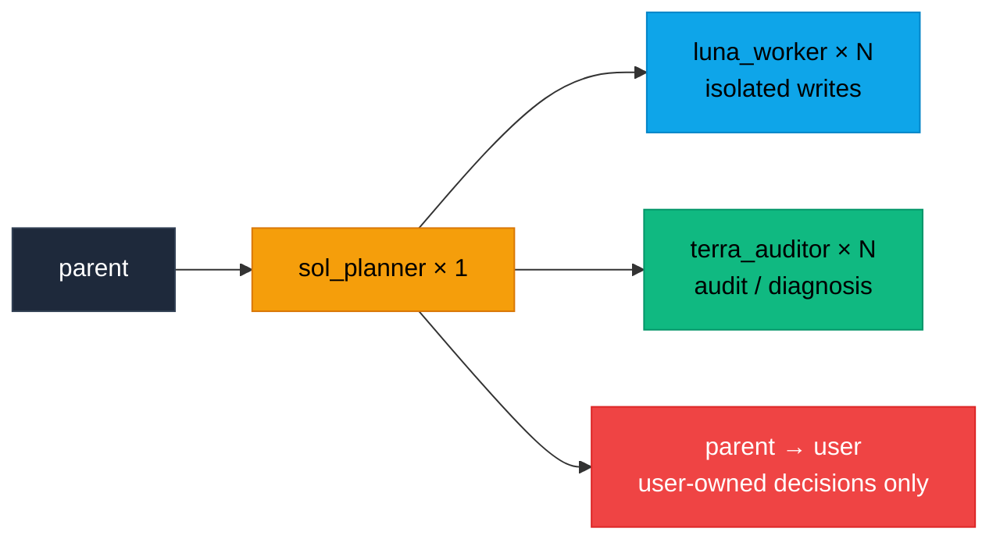
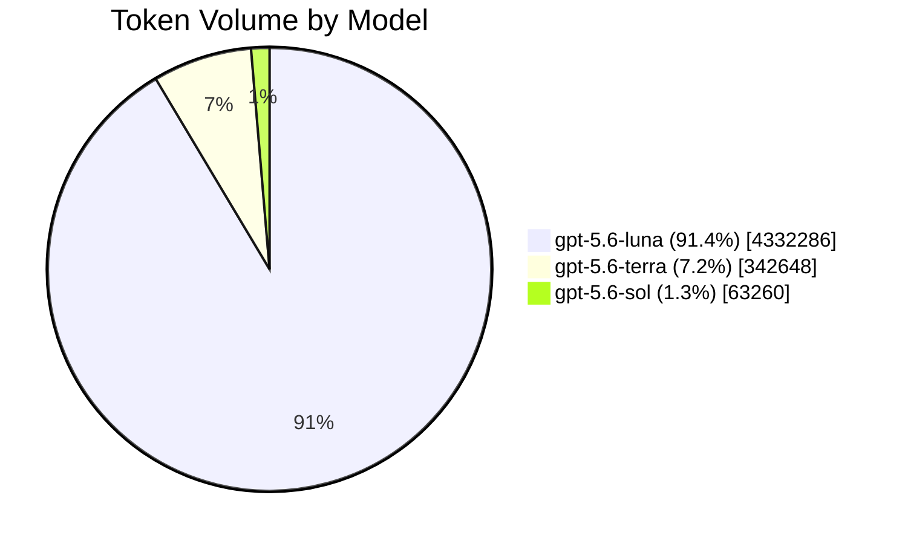
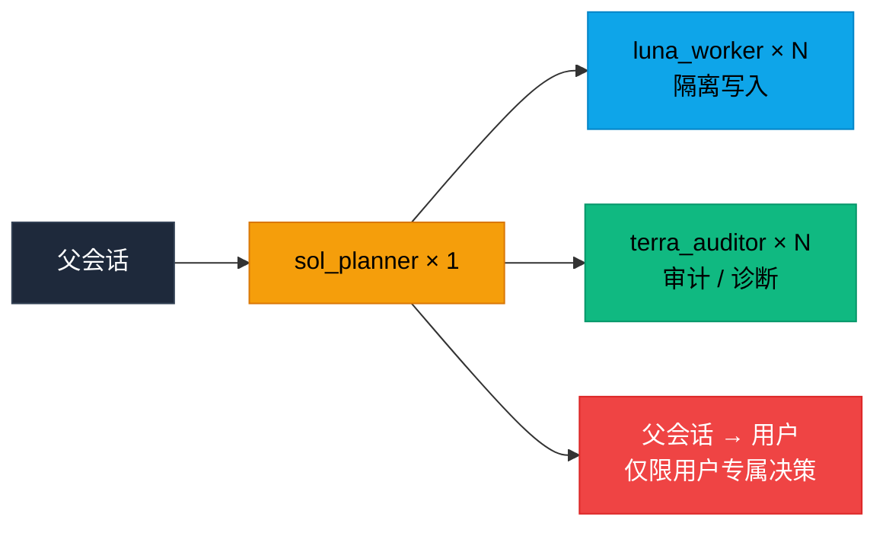
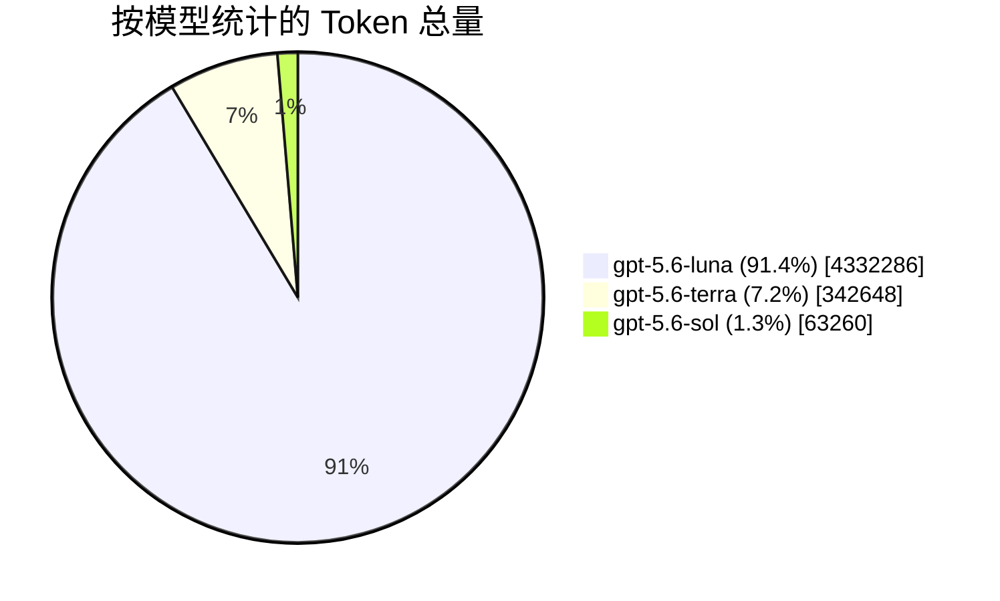

<br/>

<p align="center">
  <a href="https://zread.ai/GhostXia/lean-dev-router" target="_blank" rel="noopener noreferrer"></a>
</p>

<h1 align="center">
  <sub>⚡</sub> Lean Dev Router <sub>⚡</sub>
</h1>

<p align="center">
  <strong>智能软件工程路由 · 让每个 Agent 都在正确的位置</strong>
</p>

<p align="center">
  <em>通用理论 · 按需升级 · Token 高效 · 可复用于任意运行时</em>
</p>

<p align="center">
  <a href="#-english">English</a>
  <span>&nbsp;·&nbsp;</span>
  <a href="#-中文">中文</a>
</p>

---

## 🌟 核心亮点 / Core Highlights

> **Token 高效** — 减少不必要的 Agent 调用与交接上下文，主会话可用更低成本模型  
> **职责分层** — Sol 规划、Luna 实施、Terra 验证，各司其职按需升级  
> **协议驱动** — 紧凑可解析的 `lean-dev-router/v1` 交接协议，结果可追溯可审计  
> **并行隔离** — 每个写入 Luna 独占 worktree 或独立 checkout；避免工作区互相覆盖，语义冲突由集成门发现
> **运行时无关** — 路由理论不绑定 Codex 或 GPT，可迁移至任意 Agent 运行时

---

## 🇬🇧 English

### 📖 Overview

**Lean Dev Router** is a general theory for coordinating and escalating repository-bound software engineering lifecycle work. It assigns planning, implementation, diagnosis, and validation to agents with different responsibilities and cost levels, escalating only when necessary.

I currently use Codex, so this repository uses GPT model identifiers as concrete examples. The routing theory is not tied to Codex or GPT and can be adapted to other agent runtimes and models.

For further token savings, this router can be combined with projects such as [Caveman](https://github.com/juliusbrussee/caveman), which reduce unnecessary verbosity in engineering workflows. **Lean Dev Router** reduces unnecessary agent calls and handoff context; **Caveman** reduces unnecessary prose in agent responses. Together, they can help maximize token efficiency while preserving the technical content that matters. This project currently does not plan to duplicate response-compression features already provided by such projects.

Because the subagents use explicitly selected models and follow detailed work assignments, the main conversation can often use **Luna High** or an even lower-cost model. One **Sol** coordinator handles complex planning and cross-task coordination when needed; the main conversation remains the user-facing control surface and mechanical fallback relay.

### 🧭 Engineering Lifecycle Entry Points

| Work Type | Default Route |
|:---|:---|
| 🔧 Bounded implementation, fixes, refactors, tests, docs, config | **Luna** directly; use **Sol** first when ambiguous, decomposable, cross-cutting, or decision-heavy |
| 🔍 Audits, reviews, compliance checks, or release readiness | One or more **Terra** workers first; **Sol** partitions or consolidates when needed; **Luna** handles only authorized remediation |
| 🐛 Investigations, incidents, performance analysis, debugging | **Terra** establishes evidence and likely causes; **Sol** resolves in-scope technical trade-offs or returns user-owned choices; **Luna** applies the authorized fix |
| 🔄 Migrations, dependency upgrades, or platform upgrades | **Sol** plans within scope & defines order; **Terra** inventories compatibility & risk; isolated **Luna** worktrees implement; **Terra** verifies |
| 👑 Major direction, scope, policy, or irreversible commitments | **Sol** may frame options, but the parent returns the decision to the user |

> ⚠️ This expansion covers **repository-bound engineering work only**. It does not grant authority for production deployment, destructive operations, external commitments, or changes to business/product policy **without explicit user approval**.

### 📡 Handoff Protocol

All three roles use one compact, machine-readable handoff protocol:

```text
PROTOCOL: lean-dev-router/v1
AGENT: luna_worker | terra_auditor | sol_planner
STATUS: PASS | BLOCKED | ESCALATE
FAILURE: none | scope | verification | dependency | ambiguity | major-decision
EVIDENCE:
- path: relative/path/to/file
  proof: short diff summary or `command` -> PASS/FAIL
NEXT: parent | luna_worker | terra_auditor | sol_planner | none
SUMMARY: one concise sentence
```

**Field Semantics:**

- `EVIDENCE` — must bind repository claims to a concrete path + short diff summary or command result; item coverage uses `path: N/A (batch coverage)`, repository-wide allow-list results use `path: N/A (scope-check)`, and combined-state validation uses `path: N/A (integration-check)`
- `PASS` — current stage complete
- `BLOCKED` — required info, authority, or dependency unavailable
- `ESCALATE` — another role must act
- `NEXT` — role the coordinator should dispatch next; results always return to the spawning session

> 🛡️ Sol performs the route when present, otherwise the parent does. The parent must **not** infer success from an incomplete handoff.

### 🧯 Scope Drift Soft Gate

The primary scope control is still **Sol's Todo/DISPATCH decomposition plus precise Luna instructions**. Each write batch should be independently verifiable, path-bounded, dependency-aware, and independently retryable—without splitting work merely for ceremony. This matters even more when CI is absent. The path check below is a **low-frequency secondary fuse**, not the main scheduler.

For every **Luna write task**, distinguish read context from write authorization: `relevant paths` may be inspected, while a baseline commit plus repository-relative `paths_allow` defines what may change. Sol supplies both for routed batches; the parent supplies both for a direct Luna fast path.

Before accepting Luna's `PASS`, prefer the deterministic repository helper:

```bash
python scripts/check_scope.py --baseline <baseline> --allow <paths_allow_entry>
```

Repeat `--allow` for every authorized path. The helper performs the three mechanical Git queries and emits one compact `SCOPE: PASS` or `SCOPE: FAIL` result. The direct commands remain the fallback when the helper is unavailable:

```bash
git diff --name-only --no-renames <baseline> --
git ls-files --others --exclude-standard
git ls-files --others --ignored --exclude-standard
```

If any path falls outside `paths_allow`, Luna's original handoff remains part of the evidence, but its `PASS` is not accepted. Record `FAILURE: scope`; return obvious drive-by changes to Luna for trimming, and use Terra only when an extra path's technical necessity is unclear. Sol may explicitly amend or split the batch only within the fixed objective and acceptance criteria. Changes to user-owned scope or acceptance still use the user decision gate.

There is no automatic ignore list: expected snapshots, lockfiles, generated files, or formatter output must be authorized in advance. This check is orthogonal to CI—CI asks whether the change is correct under its encoded checks; the scope gate asks whether the batch was authorized to touch those paths. Green tests do not prove that a batch stayed within its delegated write set. An in-scope `PASS` does **not** require Terra review, and a gate that rarely triggers is evidence of good decomposition rather than a reason to remove it.

### 🧩 Integration Convergence Gate

Component success is not transitive. When two or more write batches form one deliverable, each component `PASS` closes only that batch; whole-task `PASS` requires validation of the combined state.

Before dispatch, Sol defines shared contracts, dependency order, `integration_worktree`, `integration_owner`, `integration_baseline`, `integration_paths_allow`, and `integration_acceptance`. The integration allow-list starts as the exact union of accepted batch allow-lists and changes only through an authorized Luna integration-repair batch.

Sol coordinates without modifying the integration tree. One Luna acts as `integration_owner` and combines accepted commits in dependency order; a parent fallback may perform only conflict-free mechanical merges. Conflict resolution or compatibility edits become a new bounded Luna write batch. Integrate incrementally, running narrow cross-batch checks after each dependent batch or independent wave.

Before whole-task `PASS`, require a clean integration worktree and prefer `python scripts/check_scope.py --baseline <integration_baseline> --end <combined_commit> --allow <integration_paths_allow_entry>` repeated for every authorized path. Record its compact result as `path: N/A (scope-check)`, then record the combined commit, integration order, and complete acceptance results as `path: N/A (integration-check)`. Use the direct Git commands above as fallback when the helper is unavailable.

A final Terra audit of the combined state is mandatory when the user requested independent verification, two or more component batches received Terra verification, or integration crosses a material security, data, concurrency, compatibility, migration, or public-contract boundary. Separate component audits never substitute for a required integration audit.

On failure, stop terminal success and locate the earliest failing merge or wave:

- obvious bounded compatibility repair → **Luna**
- unclear cross-component cause → **Terra**
- in-scope contract or decomposition adjustment → **Sol**
- user-owned objective, compatibility, or product trade-off → **parent → user**

### 🚪 User Decision Gate

**Sol** may decide reversible technical trade-offs that preserve the fixed objective, scope, acceptance criteria, and user-authorized policy.

Sol must return decisions about **objectives, direction, philosophy, product priority, explicit user intent, or irreversible/material commitments** to the user through the parent session.

For such a decision, Sol returns:

```text
STATUS: BLOCKED
FAILURE: major-decision
NEXT: parent
```

…with up to **three viable options**, decisive trade-offs, affected paths, **one recommendation**, and **a single question** for the user.

> 📌 The protocol intentionally omits `NEXT: user`. The route is `sol_planner → parent → user`. After the answer, an existing Sol coordinator resumes worker routing; the standalone fast path returns directly to **Luna** when all constraints are fixed.

### 🔌 Codex Execution Mode

Native Codex subagents are the default. Send a clear bounded task directly to one **Luna** only after the parent captures its baseline commit and repository-relative `paths_allow`. For complex, ambiguous, or decomposable work, start one **Sol** coordinator by default and let it partition, dispatch, wait for, and consolidate multiple **Luna** and **Terra** workers.

**Key Rules:**

- Independent read, implementation, test, and review tasks may run **in parallel**
- Every parallel **Luna writer** gets a dedicated worktree or independent checkout on its own branch — a branch alone is **not** isolation
- Read-only **Terra** workers **may** share a checkout

**Before a dependent/write handoff**, verify:
1. The intended Agent loaded
2. Its model and reasoning effort are honored
3. Its first result follows `lean-dev-router/v1`

If Sol cannot spawn nested workers, it returns `BLOCKED/dependency/NEXT parent` with a `DISPATCH` manifest in `EVIDENCE`. Each worker entry contains:
`id`, `role`, `scope`, `worktree` (`N/A` for shared read-only work), `depends_on`, and `acceptance`; Luna write entries also contain `baseline` and `paths_allow`. Multi-batch deliverables additionally declare shared contracts, `integration_worktree`, `integration_owner`, `integration_order`, `integration_baseline`, `integration_paths_allow`, `integration_acceptance`, and whether final Terra review is required.

The parent executes it mechanically and returns compact results to the same Sol. If native spawning is entirely unavailable, use independent Codex sessions with the same manifest.

> 💡 When available, check `codex --version` before relying on native routing. In the Codex CLI, use `/agent` to inspect agent threads. If the client cannot start or expose the expected native workflow, use the fallback instead of silently substituting the default agent or model.

The native Codex background-agent UI is part of the native subagent workflow. Unrelated background processes or independent sessions are fallback mechanisms, not equivalent parent-child routing. See the [official Codex subagents documentation](https://learn.chatgpt.com/docs/agent-configuration/subagents) for current client and custom-agent behavior.

### ⚙️ Default Single-Sol Worker Scheduling

Use **one Sol coordinator** for each routed task by default. Sol chooses the number and mix of Luna and Terra workers from task size, volume, independence, dependency depth, and risk. It assigns bounded work, manages ordering and concurrency, waits for workers, verifies coverage, and consolidates their compact results.

> 🚨 **Luna and Terra never create additional agents or expand their own assignments.** Use multiple Sol coordinators only when the user explicitly requests them: the parent creates them with **non-overlapping orchestration scopes**, and no Sol may spawn a peer Sol.

| Mode | Requested Cap | Priority |
|:---|:---:|:---|
| `token-first` | 3 | Minimize total agent overhead · **default mode** |
| `balanced` | 6 | Balance elapsed time and token overhead |
| `latency-first` | 10 | Minimize elapsed time for large independent workloads |

The cap covers Luna and Terra workers combined and is a routing heuristic, not a concurrency guarantee. For uniform item sets, start with `min(mode cap, ceil(items / 30))`, then adjust for complexity and risk. Keep dependent stages sequential and use disjoint waves if fewer workers start. Each worker receives an exact non-overlapping assignment; Sol verifies complete coverage and empty intersections. Every parallel Luna writer uses a dedicated worktree or independent checkout on its own branch; Sol decides integration order and assigns one Luna as integration owner.

**Example:** A latency-first audit of 282 merged PRs uses **1 Sol coordinator** + **10 Terra auditors** with roughly 28–29 PRs each. Sol waits for every batch, verifies coverage, merges and deduplicates findings, then assigns high-risk or conflicting candidates to different Terra auditors for peer verification. A development task can similarly use multiple Luna workers in isolated worktrees, plus Terra workers for diagnosis or independent verification.

> 💡 From personal experience: worktrees are recommended for batching independent tasks in parallel — especially when handling multiple PRs simultaneously. Give each task its own worktree and branch; **avoid** parallel worktrees for tightly dependent tasks or changes that must share the same working state.



### 📦 Contents

| Path | Description |
|:---|:---|
| `.agents/skills/lean-dev-router/` | The lightweight routing Skill |
| `agents/` | Example Agent config files: `luna_worker`, `sol_planner`, `terra_auditor` |
| `lean-dev-router-self-test-guide.md` | Controlled guide for measuring token savings, quality, and routing overhead |
| `lean-dev-router-l3-idempotent-orders-task.md` | Reusable L3 benchmark task packet |
| `runtime/source/` | Canonical bilingual runtime source for the generated language profiles |
| `profiles/codex/` | Codex adapter metadata and generated English/Chinese install profiles |
| `scripts/check_scope.py` | Deterministic tracked/untracked path allow-list check |
| `scripts/build_runtime.py` | Materializes one single-language runtime profile into the active paths |
| `scripts/validate_repo.py` | Dependency-free repository consistency checks used by CI |

### 🚀 Install

For **Codex**, copy:
1. `.agents/skills/lean-dev-router/` → `~/.codex/skills/lean-dev-router/`
2. The three files in `agents/` → `~/.codex/agents/`

Adapt the file format and model identifiers when using another runtime.

### 🌐 Single-language runtime profiles

The active runtime files are generated from the canonical bilingual source in `runtime/source/`. English (`en`) is the default profile and is materialized at the paths shown above. To use the Chinese profile, run:

```bash
python scripts/build_runtime.py --language zh-CN
```

Run `python scripts/build_runtime.py --language en` before committing the default profile. Do not edit generated runtime files directly; edit the bilingual source and regenerate. The generator preserves protocol identifiers, model settings, role boundaries, and routing behavior while keeping each runtime context single-language. Agents still follow the parent task's primary language when responding.

### 🧩 Codex profile

The repository keeps the routing theory runtime-agnostic and provides Codex-specific integration as an adapter under `profiles/codex/`. Generate the installable English and Chinese Codex profiles with:

```bash
python scripts/build_runtime.py --language en --output-dir profiles/codex/en
python scripts/build_runtime.py --language zh-CN --output-dir profiles/codex/zh-CN
```

The profile captures Codex native-subagent behavior, the independent-session fallback, and the configured model mapping. It is generated from `runtime/source/` and is not maintained as a long-lived Codex-only branch.

### 🎭 Roles

| Role | Badge | Responsibility |
|:---|:---:|:---|
| **sol_planner** | 👑 | Single planner & orchestrator for complex tasks. Scales, directs, and consolidates Luna/Terra workers; returns user-owned decisions to the parent. |
| **luna_worker** | ⚡ | Bounded code, test, documentation, and configuration edits. Multiple instances may run in parallel on isolated assignments. |
| **terra_auditor** | 🔍 | Code audit, technical diagnosis, and validation. Escalate only when it cannot resolve the issue or a major decision is required. |

Use `$lean-dev-router` when a task benefits from this routing policy. The Skill deliberately avoids invoking all agents by default and passes only compact handoff information.

### 📊 Final L3 Test Result

This is a recorded run of the initial L3 idempotent `POST /orders` task revision at [`6d803af`](https://github.com/GhostXia/lean-dev-router/blob/6d803af52d9f651093413036226562f07da4b052/lean-dev-router-l3-idempotent-orders-task.md), using a **Luna High** controller with `$lean-dev-router`. The current reusable task packet is [`lean-dev-router-l3-idempotent-orders-task.md`](lean-dev-router-l3-idempotent-orders-task.md). Figures are transcribed from supplied run screenshots — not a rerun in this repository.



| Model | Total Tokens | Share | Input | Cached Input | Output | Events |
|:---|---:|:---:|---:|---:|---:|---:|
| `gpt-5.6-luna` | 4,332,286 | 91.4% | 4,304,634 | 4,156,160 | 27,652 | 105 |
| `gpt-5.6-terra` | 342,648 | 7.2% | 335,741 | 301,312 | 6,907 | 11 |
| `gpt-5.6-sol` | 63,260 | 1.3% | 61,736 | 47,360 | 1,524 | 3 |
| **Total** | **4,738,194** | **100%** | **4,702,111** | **4,504,832** | **36,083** | **119** |

| Check | Recorded Result |
|:---|:---|
| ⏱️ Duration | **12m 15s** |
| ✅ Required Behavior | First create `201`; replay `200`; conflicting key `409`; invalid input `400` |
| 🔒 Concurrency | `RLock` protects same-key creation; one order for concurrent duplicate submissions |
| 🧪 Tests | `python -m pytest tests/ -q` → **9 passed** ✅ |
| 🎯 Scope | Screenshot showed those four tracked paths via `git diff --stat`; untracked paths were not independently recorded |
| 📌 Baseline | `92ea4575174a163657005711057c97db97776845` |

The run used **405,908** tokens outside Luna (~**8.6%** of total). This is a routed-run cost profile, not a standalone savings rate; a savings claim still requires the same-packet Sol and direct-Luna control runs described in the self-test guide.

> Historical evidence note: this run predates the current tracked-plus-untracked scope gate and integration convergence gate. It must not be treated as validation of those newer controls.

---

## 🇨🇳 中文

### 📖 概述

**Lean Dev Router** 是一套用于协调和升级仓库范围内软件工程全生命周期任务的通用理论。它让不同职责和成本层级的 Agent 分别负责**规划、实施、诊断和验证**，并且只在必要时向上升级。

我本人目前正在使用 Codex，因此本仓库使用 GPT 模型标识作为具体示例。这套路由理论**不依赖** Codex 或 GPT，也可以迁移到其他 Agent 运行时和模型。

为了进一步节省 Token，可以配合 [Caveman](https://github.com/juliusbrussee/caveman) 这类减少工程中冗余表达的项目使用。**Lean Dev Router** 负责减少不必要的 Agent 调用和交接上下文，**Caveman** 负责减少 Agent 回复中的冗余措辞；两者结合可以在保留关键技术内容的同时，进一步提高 Token 使用效率。本项目目前暂不考虑重复实现这类项目已经提供的回复压缩功能。

由于各 Subagent 使用的模型明确、职责边界清晰且工作安排详细，主控对话通常可以使用 **Luna High** 或更低成本的模型。需要复杂规划和跨任务协调时，由一个 **Sol** 协调者处理；主控对话保留用户交互入口，并在必要时只做机械中继。

### 🧭 工程生命周期任务入口

| 任务类型 | 默认路由 |
|:---|:---|
| 🔧 边界明确的实现、修复、重构、测试、文档或配置 | 直接交给 **Luna**；任务模糊、可拆分、跨模块或决策较多时先使用 **Sol** |
| 🔍 审计、审查、合规检查或发布就绪 | 先使用一个或多个 **Terra**；需要时由 **Sol** 拆分或归并；只有获得授权后才由 **Luna** 修复 |
| 🐛 调查、事件、性能分析或调试 | **Terra** 建立证据和可能原因；**Sol** 裁定范围内的技术取舍，属于用户的选择则交还父会话；**Luna** 实施获得授权的修复 |
| 🔄 迁移、依赖或平台升级 | **Sol** 在已授权范围内规划并确定实施顺序；**Terra** 盘点兼容性与风险；**Luna** 在隔离 worktree 中实施；**Terra** 验证 |
| 👑 重大方向、范围、策略或不可逆承诺 | **Sol** 可以整理选项，但父会话必须将决断权交还用户 |

> ⚠️ 本次扩展**仅覆盖仓库范围内**的软件工程任务。未经用户明确批准，不授予生产部署、破坏性操作、外部承诺或业务及产品策略变更的权限。

### 📡 交接协议

三个角色统一使用以下紧凑、可解析的交接协议：

```text
PROTOCOL: lean-dev-router/v1
AGENT: luna_worker | terra_auditor | sol_planner
STATUS: PASS | BLOCKED | ESCALATE
FAILURE: none | scope | verification | dependency | ambiguity | major-decision
EVIDENCE:
- path: relative/path/to/file
  proof: short diff summary or `command` -> PASS/FAIL
NEXT: parent | luna_worker | terra_auditor | sol_planner | none
SUMMARY: one concise sentence
```

**字段语义：**

- `EVIDENCE` — 必须将仓库结论绑定到具体路径，并附简短 diff 摘要或命令结果；项目覆盖使用 `path: N/A (batch coverage)`，仓库级 allow-list 结果使用 `path: N/A (scope-check)`，组合状态验证使用 `path: N/A (integration-check)`
- `PASS` — 当前阶段完成
- `BLOCKED` — 缺少必要信息、权限或依赖
- `ESCALATE` — 需要其他角色继续处理
- `NEXT` — 当前协调者下一步应派发的角色，结果仍返回启动该 Agent 的会话

> 🛡️ 存在 **Sol** 时由 **Sol** 执行，否则由父会话执行。主控**不得**从缺少字段或证据的交接中自行推断成功。

### 🧯 范围漂移软门

主要范围控制仍然是 **Sol 的 Todo/DISPATCH 拆分与精确的 Luna 指令**。每个写入批次都应可独立验证、路径有界、依赖明确且失败后可单独重做，但不要为了形式而过度拆分。没有 CI 时，这一点尤其重要。下面的路径检查只是**低频辅路保险丝**，不是主调度器。

每个 **Luna 写入任务**都必须区分读取上下文与写入授权：`relevant paths` 可以读取，而 baseline commit 与仓库相对 `paths_allow` 才定义允许改动的路径。路由批次由 Sol 提供两项字段，直接 Luna 快路径由父会话提供。

接受 Luna 的 `PASS` 前，优先使用确定性的仓库 helper：

```bash
python scripts/check_scope.py --baseline <baseline> --allow <paths_allow_entry>
```

对每个授权路径重复传入 `--allow`。helper 会机械执行三类 Git 查询，并输出一条紧凑的 `SCOPE: PASS` 或 `SCOPE: FAIL` 结果。helper 不存在时，才使用以下命令 fallback：

```bash
git diff --name-only --no-renames <baseline> --
git ls-files --others --exclude-standard
git ls-files --others --ignored --exclude-standard
```

只要存在 `paths_allow` 之外的路径，就保留 Luna 的原始交接作为证据，但不得接受其 `PASS`；使用 `FAILURE: scope` 记录结果。明显的顺手改动直接退回 Luna 裁剪，只有额外路径的技术必要性不明确时才调用 Terra。Sol 仅可在既定目标和验收标准内显式修订或拆分批次；涉及用户专属范围或验收变化时仍进入用户决策门。

默认没有自动忽略清单：预期的快照、锁文件、生成文件或格式化输出都必须提前授权。该检查与 CI 正交——CI 判断改动是否通过其编码的正确性检查，范围门判断该批次是否获准触碰这些路径；测试全绿不能证明批次没有超出写入授权。范围内的 `PASS` **不要求** Terra 审查；范围门很少触发说明拆分良好，不代表应移除它。

### 🧩 集成收敛门

组件成功不具有传递性。当两个或更多写入批次共同组成一个交付物时，每个组件 `PASS` 只关闭对应批次；整体任务 `PASS` 必须验证组合后的统一状态。

派发前，Sol 需要定义共享契约、依赖顺序、`integration_worktree`、`integration_owner`、`integration_baseline`、`integration_paths_allow` 和 `integration_acceptance`。集成 allow-list 初始值是已接受批次 allow-list 的精确并集，只有获得授权的 Luna 集成修复批次才能修改。

Sol 只负责协调，不修改集成树。由一个 Luna 担任 `integration_owner`，按依赖顺序组合已接受提交；父会话 fallback 只能执行无冲突的机械合入。冲突解决或兼容性编辑必须成为新的、有边界的 Luna 写入批次。采用增量集成，每个依赖批次或独立波次后运行最小必要的跨批检查。

返回整体任务 `PASS` 前，必须确认集成工作树干净，并优先使用 `python scripts/check_scope.py --baseline <integration_baseline> --end <combined_commit> --allow <integration_paths_allow_entry>`，对每个授权路径重复传入 `--allow`。以 `path: N/A (scope-check)` 记录其紧凑结果，再以 `path: N/A (integration-check)` 记录组合提交、集成顺序和完整验收结果。helper 不存在时才使用上面的 Git 命令 fallback。

用户要求独立验证、两个或更多组件批次接受了 Terra 验证，或集成跨越重大安全、数据、并发、兼容性、迁移或公共契约边界时，必须对组合状态进行最终 Terra 审计。需要集成审计时，各组件分别通过审计不能替代它。

集成失败时不得宣布最终成功，并定位最早失败的合入或波次：

- 明确且边界清晰的兼容修复 → **Luna**
- 跨组件原因不明确 → **Terra**
- 范围内的契约或拆分调整 → **Sol**
- 用户专属目标、兼容性或产品取舍 → **父会话 → 用户**

### 🚪 用户决策门

**Sol** 可以裁定不改变既定目标、范围、验收标准和用户授权策略的可逆技术取舍。

涉及**目标、方向、理念、产品优先级、用户明确意图，或不可逆及重大的承诺**时，**Sol** 必须通过父会话将决断权交还用户。

此时 **Sol** 返回：

```text
STATUS: BLOCKED
FAILURE: major-decision
NEXT: parent
```

…并提供最多**三个可行方案**、关键取舍、受影响路径、**一个推荐**和需要询问用户的**唯一问题**。

> 📌 协议不增加 `NEXT: user`：正确路径是 `sol_planner → parent → user`。用户答复后，已有 **Sol** 协调者继续调度其 worker；独立快路径在约束完整确定时直接返回 **Luna**。

### 🔌 Codex 执行方式

默认使用 Codex 原生 subagent。明确且边界清晰的任务，必须先由父会话记录 baseline commit 与仓库相对 `paths_allow`，再直接交给一个 **Luna**；复杂、模糊或可拆分任务默认启动一个 **Sol** 协调者，由其分解、分配、等待和归并多个 **Luna/Terra**。

**核心规则：**

- 相互独立的读取、实现、测试和审查任务均可**并行**
- 每个并行写入的 **Luna** 必须使用独立 worktree 或独立 checkout，并绑定各自分支——只有分支**不构成**隔离
- 只读的 **Terra** **可以**共享 checkout

**在有依赖或写入的交接前**，请确认：
1. 目标 Agent 已加载
2. 模型和思考强度生效
3. 首次结果遵循 `lean-dev-router/v1`

如果 **Sol** 无法嵌套启动 worker，应返回 `BLOCKED/dependency/NEXT parent`，并在 `EVIDENCE` 中提供 `DISPATCH` 清单。每个 worker 条目包含：
`id`、`role`、`scope`、`worktree`（共享只读任务使用 `N/A`）、`depends_on` 和 `acceptance`；Luna 写入条目还包含 `baseline` 和 `paths_allow`。多批次交付还必须声明共享契约、`integration_worktree`、`integration_owner`、`integration_order`、`integration_baseline`、`integration_paths_allow`、`integration_acceptance`，以及是否需要最终 Terra 审查。

父会话机械执行后，将紧凑结果送回同一个 **Sol**。原生调用完全不可用时，使用相同清单启动独立 Codex session。

> 💡 条件允许时，在依赖原生路由前检查 `codex --version`；在 Codex CLI 中使用 `/agent` 检查 Agent 线程。如果客户端无法启动或无法提供预期的原生流程，应使用 fallback，**不要**静默替换为默认 Agent 或模型。

Codex 原生后台 Agent 界面仍属于原生 subagent 流程；其他后台进程或独立 session 只能作为 fallback，不能视为等价的父子路由。当前 Codex 自定义 Agent 的行为以[官方 Subagents 文档](https://learn.chatgpt.com/docs/agent-configuration/subagents)为准。

### ⚙️ 默认单 Sol Worker 调度

每个路由任务默认只使用**一个 Sol 协调者**。Sol 根据任务规模、数量、独立性、依赖深度和风险决定 Luna/Terra 的数量及组合，负责任务分配、顺序与并发、等待 worker、覆盖检查和结果归并。

> 🚨 **Luna 和 Terra 不得自行创建 Agent 或扩大任务范围。** 只有用户明确要求时才使用多个 Sol；由父会话创建并为每个 Sol 分配**互不重叠**的调度范围，任何 Sol 都**不得**启动同级 Sol。

| 模式 | 请求上限 | 优先目标 |
|:---|:---:|:---|
| `token-first` | 3 | 尽量减少 Agent 总开销 · **默认模式** |
| `balanced` | 6 | 平衡完成时间与 Token 开销 |
| `latency-first` | 10 | 缩短大型独立任务的完成时间 |

上限包含 Luna 与 Terra 的总数，属于调度启发式，不代表客户端或账户一定具备对应并发能力。对相对均匀的项目集合，先使用 `min(模式上限, ceil(项目数 / 30))`，再按复杂度和风险调整。有依赖的阶段保持串行；可用 worker 较少时使用互不重叠的波次。每个 worker 获得精确且不重叠的任务；Sol 确认覆盖完整且交集为空。每个并行 Luna 写入者使用独立 worktree 或独立 checkout，并绑定各自分支；Sol 决定集成顺序并指定一个 Luna 作为 integration owner。

**示例：** 对 282 个已合并 PR 进行 `latency-first` 审计时，使用 **1 个 Sol 协调者** + **10 个 Terra**，每个约 28–29 个 PR。Sol 等待所有批次、检查覆盖范围、归并去重发现，再将高风险或冲突候选交给不同的 Terra 交叉验证。开发任务同样可以让多个 Luna 在隔离 worktree 中并行实现，并搭配 Terra 诊断或独立验证。

> 💡 个人经验：推荐使用 worktree 批量并行处理相互独立的任务，尤其适合同时推进多个 PR。为每个任务分配独立的 worktree 和分支；对于强依赖任务，或必须共享同一工作状态的改动，**不建议**并行处理。



### 📦 内容

| 路径 | 说明 |
|:---|:---|
| `.agents/skills/lean-dev-router/` | 轻量级调度 Skill |
| `agents/` | 示例 Agent 配置：`luna_worker`、`sol_planner`、`terra_auditor` |
| `lean-dev-router-self-test-guide.md` | 用于在自己的代码库中对比 Token 节省、质量和调度开销的受控测试指南 |
| `lean-dev-router-l3-idempotent-orders-task.md` | 可复用的 L3 基准测试题包 |
| `runtime/source/` | 生成语言 profile 的规范双语运行时源文件 |
| `profiles/codex/` | Codex adapter 元数据及中英文生成安装 profile |
| `scripts/check_scope.py` | 机械检查 tracked、untracked 路径是否符合 allow-list |
| `scripts/build_runtime.py` | 将单一语言运行时 profile 写入当前生效路径 |
| `scripts/validate_repo.py` | CI 使用的零依赖仓库一致性检查 |

### 🚀 安装

对于 **Codex**，复制：
1. `.agents/skills/lean-dev-router/` → `~/.codex/skills/lean-dev-router/`
2. `agents/` 中的三个 TOML 文件 → `~/.codex/agents/`

使用其他运行时或模型时，应相应调整文件格式和模型标识。

### 🌐 单语言运行时 profile

当前生效的运行时文件由 `runtime/source/` 中的规范双语源文件生成。默认 profile 是英语（`en`），会写入上面列出的现有路径。需要中文 profile 时运行：

```bash
python scripts/build_runtime.py --language zh-CN
```

提交默认 profile 前运行 `python scripts/build_runtime.py --language en`。不要直接编辑生成的运行时文件；请修改双语源文件后重新生成。生成器只改变语言载荷，不改变协议标识、模型设置、角色边界或路由行为；Agent 回复仍应跟随父任务的主要语言。

### 🧩 Codex profile

仓库继续保持路由理论的运行时无关性，并在 `profiles/codex/` 下提供 Codex 专用 adapter。使用以下命令生成可安装的中英文 Codex profile：

```bash
python scripts/build_runtime.py --language en --output-dir profiles/codex/en
python scripts/build_runtime.py --language zh-CN --output-dir profiles/codex/zh-CN
```

该 profile 固化 Codex 原生 subagent 行为、独立 session fallback 和当前模型映射。它由 `runtime/source/` 生成，不维护长期存在的 Codex 专用分支。

### 🎭 角色

| 角色 | 徽章 | 职责 |
|:---|:---:|:---|
| **sol_planner** | 👑 | 复杂任务的唯一规划者和协调者。按需扩缩、指挥并归并 Luna/Terra，属于用户的决策交还父会话。 |
| **luna_worker** | ⚡ | 边界明确的代码、测试、文档和配置改动。多个实例可以在隔离任务上并行运行。 |
| **terra_auditor** | 🔍 | 代码审计、技术诊断和验证。只有无法解决问题或需要重大决策时才升级给 Sol。 |

当任务适合采用这套路由策略时，可以使用 `$lean-dev-router`。该 Skill 不会默认调用全部 Agent，只传递精简的交接信息。

### 📊 最终 L3 测试结果

这是一次 L3 幂等 `POST /orders` 测试记录，使用的是测试题初始版本 [`6d803af`](https://github.com/GhostXia/lean-dev-router/blob/6d803af52d9f651093413036226562f07da4b052/lean-dev-router-l3-idempotent-orders-task.md)，主控为 **Luna High** 并使用 `$lean-dev-router`。当前可复用题包见 [`lean-dev-router-l3-idempotent-orders-task.md`](lean-dev-router-l3-idempotent-orders-task.md)。下列数据根据用户提供的测试截图整理，**未**在本仓库重新运行。



| 模型 | 总 Token | 占比 | Input | Cached Input | Output | 事件数 |
|:---|---:|:---:|---:|---:|---:|---:|
| `gpt-5.6-luna` | 4,332,286 | 91.4% | 4,304,634 | 4,156,160 | 27,652 | 105 |
| `gpt-5.6-terra` | 342,648 | 7.2% | 335,741 | 301,312 | 6,907 | 11 |
| `gpt-5.6-sol` | 63,260 | 1.3% | 61,736 | 47,360 | 1,524 | 3 |
| **合计** | **4,738,194** | **100%** | **4,702,111** | **4,504,832** | **36,083** | **119** |

| 检查项 | 记录结果 |
|:---|:---|
| ⏱️ 耗时 | **12 分 15 秒** |
| ✅ 必需行为 | 首次创建 `201`；重放 `200`；冲突 key `409`；无效输入 `400` |
| 🔒 并发 | 使用 `RLock` 保护同 key 创建；并发重复提交最终只创建一个订单 |
| 🧪 测试 | `python -m pytest tests/ -q` → **9 passed** ✅ |
| 🎯 范围 | 截图中的 `git diff --stat` 显示四个 tracked 路径；未独立记录 untracked 路径 |
| 📌 基线 | `92ea4575174a163657005711057c97db97776845` |

本次运行中，Luna 之外的模型合计消耗 **405,908** tokens，约占总量 **8.6%**。这表示本次调度运行的成本构成，不等同于独立的节省率；若要得出节省结论，仍需按照测试指南使用相同题包进行 Direct Sol 和 Direct Luna 对照测试。

> 历史证据说明：该次运行早于当前 tracked + untracked 范围门与集成收敛门，不能用来证明这些较新的控制已经生效。

---

<p align="center">
  <sub>Built with ⚡ by the routing theory · lean-dev-router/v1</sub>
</p>
