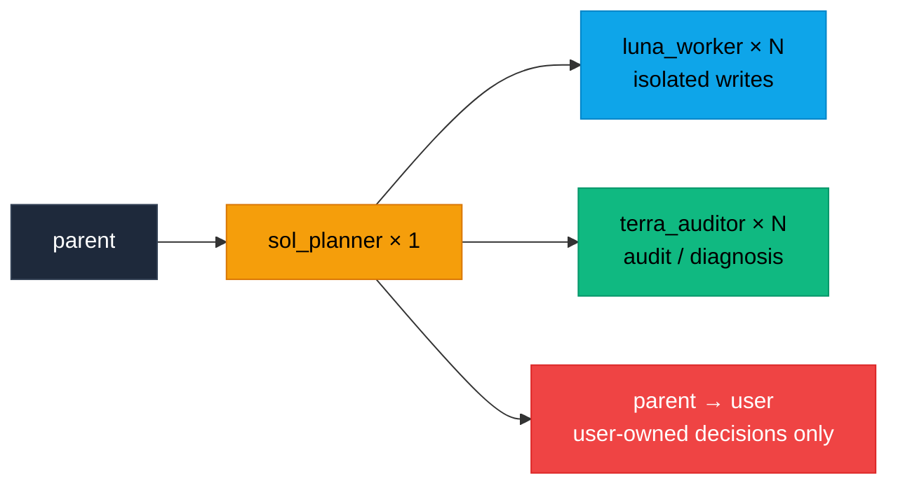
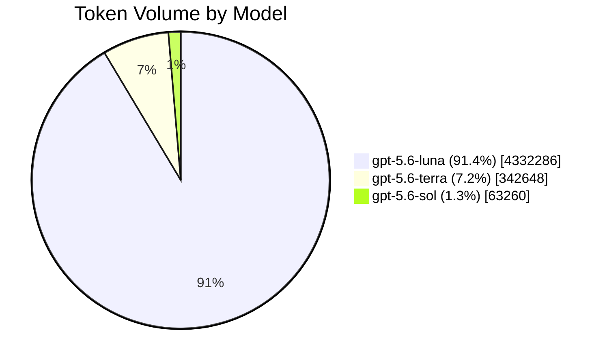

<br/>

<p align="center">
  <a href="https://zread.ai/GhostXia/lean-dev-router" target="_blank" rel="noopener noreferrer"></a>
</p>

<h1 align="center">
  <sub>⚡</sub> Lean Dev Router <sub>⚡</sub>
</h1>

<p align="center">
  <strong>Software engineering routing that puts each agent in the right role</strong>
</p>

<p align="center">
  <em>Runtime-independent · Escalate on demand · Token-efficient</em>
</p>

<p align="center">
  <a href="#-english">English</a>
  <span>&nbsp;·&nbsp;</span>
  <a href="docs/zh-CN/README.md">Chinese documentation</a>
</p>

---

## 🌟 Core Highlights

> **Token-efficient** — Reduce unnecessary agent calls and handoff context.
> **Role-separated** — Sol plans, Luna implements, and Terra validates.
> **Protocol-driven** — Compact, auditable `lean-dev-router/v2` handoffs.
> **Isolated parallelism** — Every writing Luna owns a separate worktree or checkout.
> **Runtime-independent** — The routing theory is portable beyond Codex and GPT.

---

## 🇬🇧 English

> The directly executable runtime under `.agents/` and `agents/` is English-only and is the single source of truth. [Chinese documentation](docs/zh-CN/README.md) is maintained separately for human readers and is never assembled into agent runtime context.

### 📖 Overview

**Lean Dev Router** is a general theory for coordinating and escalating repository-bound software engineering lifecycle work. It assigns planning, implementation, diagnosis, and validation to agents with different responsibilities and cost levels, escalating only when necessary.

I currently use Codex, so this repository uses GPT model identifiers as concrete examples. The routing theory is not tied to Codex or GPT and can be adapted to other agent runtimes and models.

For further token savings, this router can be combined with projects such as [Caveman](https://github.com/juliusbrussee/caveman), which reduce unnecessary verbosity in engineering workflows. **Lean Dev Router** reduces unnecessary agent calls and handoff context; **Caveman** reduces unnecessary prose in agent responses. Together, they can help maximize token efficiency while preserving the technical content that matters. This project currently does not plan to duplicate response-compression features already provided by such projects.

Because the subagents use explicitly selected models and follow detailed work assignments, the main conversation can often use **Luna High** or an even lower-cost model. One **Sol** coordinator handles complex planning and cross-task coordination when needed; the main conversation remains the user-facing control surface and mechanical fallback relay.

### 🧭 Engineering Lifecycle Entry Points

| Work Type | Default Route |
|:---|:---|
| 🔧 Bounded implementation, fixes, refactors, tests, docs, config | **Sol** issues a minimal single-step `DISPATCH` to **Luna**; harder work receives fuller planning and decomposition |
| 🔍 Audits, reviews, compliance checks, or release readiness | One or more **Terra** workers first; **Sol** partitions or consolidates when needed; **Luna** handles only authorized remediation |
| 🐛 Investigations, incidents, performance analysis, debugging | **Terra** establishes evidence and likely causes; **Sol** resolves in-scope technical trade-offs or returns user-owned choices; **Luna** applies the authorized fix |
| 🔄 Migrations, dependency upgrades, or platform upgrades | **Sol** plans within scope & defines order; **Terra** inventories compatibility & risk; isolated **Luna** worktrees implement; **Terra** verifies |
| 👑 Major direction, scope, policy, or irreversible commitments | **Sol** may frame options, but the parent returns the decision to the user |

> ⚠️ This expansion covers **repository-bound engineering work only**. It does not grant authority for production deployment, destructive operations, external commitments, or changes to business/product policy **without explicit user approval**.

### 📡 Dispatch and Handoff Protocol

Execution authority is a distinct inbound contract. Luna must receive this complete artifact before any implementation tool or write:

```text
PROTOCOL: lean-dev-router/v2
STATUS: DISPATCH
TARGET: implementation
TASK_SUMMARY: one bounded objective
BASELINE: commit hash
PATHS_ALLOW:
- relative/path/or/subtree
ACCEPTANCE:
- objective check and expected result
CONSTRAINTS:
- fixed implementation or compatibility bound
NEXT: parent
```

Only Sol authors or amends a `DISPATCH`; the parent may relay it unchanged. Missing fields, non-relative write paths, or open major product/architecture decisions make it invalid. Luna then performs no implementation work and returns `BLOCKED / missing_dispatch / NEXT parent` without naming a planning role. A minimal single-step `DISPATCH` preserves the L1 path without weakening the gate.

Inbound `DISPATCH` does not include `AGENT`. When an L1 task has no narrower constraint, use a concrete minimal entry such as `minimal change only` rather than leaving `CONSTRAINTS` empty. Workers request capabilities rather than naming peers; the parent performs a deterministic role-and-request lookup without interpreting the evidence.

All three roles use a separate compact outbound result protocol:

```text
PROTOCOL: lean-dev-router/v2
AGENT: luna_worker | terra_auditor | sol_planner
STATUS: PASS | BLOCKED | ESCALATE
FAILURE: none | missing_dispatch | scope | verification | dependency | ambiguity | major-decision
REQUEST: none | implementation | technical_resolution | planning_resolution | human_authority
EVIDENCE:
- path: relative/path/to/file
  proof: short diff summary or `command` -> PASS/FAIL
NEXT: parent
SUMMARY: one concise sentence
```

**Field Semantics:**

- `EVIDENCE` — must bind repository claims to a concrete path + short diff summary or command result; item coverage uses `path: N/A (batch coverage)`, repository-wide allow-list results use `path: N/A (scope-check)`, and combined-state validation uses `path: N/A (integration-check)`
- `PASS` — current stage complete
- `BLOCKED` — required info, authority, or dependency unavailable
- `ESCALATE` — another role must act
- `REQUEST` — capability required next; never an execution authorization
- `NEXT` — always `parent`, returning the result to the spawning session

`PASS`, `BLOCKED`, and `ESCALATE` are results, never write authorization. `PLAN_READY` is not an execution status.

`NEXT` always returns the result to the parent. `REQUEST` carries only the capability needed next and never authorizes a write. Only Sol and the parent know concrete topology. The spawning coordinator or parent applies the authoritative role-status-request table in the Skill; invalid combinations are rejected instead of inferred from prose. In particular, `PASS/none` completes the current stage, while `BLOCKED/none` pauses it at the current coordinator without dispatching a new capability.

Version 2 is intentionally incompatible with `lean-dev-router/v1`: v2 requires `REQUEST` and removes concrete agent names from `NEXT`. Coordinators must reject mixed-version handoffs instead of guessing missing fields or translating them implicitly.

#### Migrating from v1 to v2

1. Replace the Skill and all three Agent TOML files together; do not mix installed v1 and v2 runtime files.
2. Replace stored `PROTOCOL: lean-dev-router/v1` templates with `PROTOCOL: lean-dev-router/v2`.
3. Add `REQUEST` to every outbound result and select only a combination listed in the Skill's role-status-request table.
4. Replace every named outbound `NEXT` value with `NEXT: parent`; keep inbound write authorization as a complete Sol-issued `DISPATCH`.
5. Do not resume an in-flight v1 handoff chain as v2. Finish or stop it, then start a fresh v2 coordination session.
6. Run `python scripts/validate_repo.py` and the repository tests after replacing local runtime files.

> 🛡️ The spawning coordinator or parent performs the fixed role-and-request lookup. It must **not** infer a route or success from an incomplete handoff.

### 🔐 Security and Enforcement Boundary

`DISPATCH` is a protocol authorization statement, not a cryptographic signature or proof of origin. Likewise, `PATHS_ALLOW` and `scripts/check_scope.py` constrain declared scope and detect drift; they do not prevent an agent or process from writing through the operating system.

Terra's read-only guarantee depends on Codex enforcing its configured read-only sandbox. The host sandbox, filesystem permissions, and isolated worktrees remain the final enforcement layer. The parent and Sol are therefore a trusted coordination plane: this protocol does not claim to defend against a malicious or compromised agent that already has host-level write access.

### 🚧 Hard Entry Gate and Scope Fuse

The hard entry gate is the valid inbound `DISPATCH`. The primary scope control is **Sol's Todo/DISPATCH decomposition plus precise Luna instructions**. Each write batch should be independently verifiable, path-bounded, dependency-aware, and independently retryable—without splitting work merely for ceremony. This matters even more when CI is absent. The path check below is a **low-frequency secondary fuse**, not the main scheduler.

For every **Luna write task**, distinguish read context from write authorization: `relevant paths` may be inspected, while `BASELINE` plus repository-relative `PATHS_ALLOW` in Sol's dispatch defines what may change. The parent cannot create a direct Luna fast path.

Before accepting Luna's `PASS`, Sol—or the parent mechanically relaying for Sol—independently checks tracked, standard untracked, and ignored untracked paths:

```bash
git diff --name-only --no-renames <baseline> --
git ls-files --others --exclude-standard
git ls-files --others --ignored --exclude-standard
```

If any path falls outside `paths_allow`, Luna's original handoff remains part of the evidence, but its `PASS` is not accepted. Record `FAILURE: scope`; return obvious drive-by changes to Luna for trimming, and use Terra only when an extra path's technical necessity is unclear. Sol may explicitly amend or split the batch only within the fixed objective and acceptance criteria. Changes to user-owned scope or acceptance still use the user decision gate.

There is no automatic ignore list: expected snapshots, lockfiles, generated files, or formatter output must be authorized in advance. This check is orthogonal to CI—CI asks whether the change is correct under its encoded checks; the scope gate asks whether the batch was authorized to touch those paths. Green tests do not prove that a batch stayed within its delegated write set. An in-scope `PASS` does **not** require Terra review, and a gate that rarely triggers is evidence of good decomposition rather than a reason to remove it.

### 🧩 Integration Convergence Gate

Component success is not transitive. When two or more write batches form one deliverable, each component `PASS` closes only that batch; whole-task `PASS` requires validation of the combined state.

Before dispatch, Sol defines shared contracts, dependency order, `integration_worktree`, `integration_owner`, `integration_baseline`, `integration_paths_allow`, and `integration_acceptance`. The integration allow-list starts as the exact union of accepted batch allow-lists and changes only through an authorized Luna integration-repair batch.

Sol coordinates without modifying the integration tree. One Luna acts as `integration_owner` and combines accepted commits in dependency order; a parent fallback may perform only conflict-free mechanical merges. Conflict resolution or compatibility edits become a new bounded Luna write batch. Integrate incrementally, running narrow cross-batch checks after each dependent batch or independent wave.

Before whole-task `PASS`, require a clean integration worktree and verify that every tracked path from `integration_baseline` to the combined commit plus every standard and ignored untracked path is covered by `integration_paths_allow`. Enumerate the two untracked classes with `git ls-files --others --exclude-standard` and `git ls-files --others --ignored --exclude-standard`. Record that result as `path: N/A (scope-check)`, then record the combined commit, integration order, and complete acceptance results as `path: N/A (integration-check)`.

A final Terra audit of the combined state is mandatory when the user requested independent verification, two or more component batches received Terra verification, or integration crosses a material security, data, concurrency, compatibility, migration, or public-contract boundary. Separate component audits never substitute for a required integration audit.

On failure, stop terminal success and locate the earliest failing merge or wave:

- obvious bounded compatibility repair → **Luna**
- unclear cross-component cause → **Terra**
- in-scope contract or decomposition adjustment → **Sol**
- user-owned objective, compatibility, or product trade-off → **parent → user**

### 🚪 User Decision Gate

**Sol** may decide reversible technical trade-offs that preserve the fixed objective, scope, acceptance criteria, and user-authorized policy.

Sol must return decisions about **objectives, direction, philosophy, product priority, explicit user intent, or irreversible/material commitments** to the user through the parent session.

For such a decision, Sol returns:

```text
STATUS: BLOCKED
FAILURE: major-decision
REQUEST: human_authority
NEXT: parent
```

…with up to **three viable options**, decisive trade-offs, affected paths, **one recommendation**, and **a single question** for the user.

> 📌 The protocol intentionally omits `NEXT: user`. The route is `sol_planner → parent → user`. After the answer, the existing Sol coordinator resumes worker routing and issues a new valid `DISPATCH` when all constraints are fixed.

### 🔌 Codex Execution Mode

Native Codex subagents are the default. Start every change-producing task with one **Sol** coordinator. Sol emits a minimal single-step `DISPATCH` for bounded L1 work, or partitions and coordinates multiple **Luna** and **Terra** workers when the work is complex, ambiguous, or decomposable.

**Key Rules:**

- Independent read, implementation, test, and review tasks may run **in parallel**
- Every parallel **Luna writer** gets a dedicated worktree or independent checkout on its own branch — a branch alone is **not** isolation
- Read-only **Terra** workers **may** share a checkout

**Before a dependent/write handoff**, verify:
1. The intended Agent loaded
2. Its model and reasoning effort are honored
3. Its first result follows `lean-dev-router/v2`

If Sol cannot spawn nested workers, it returns `BLOCKED/dependency/REQUEST implementation/NEXT parent` with a `DISPATCH` manifest in `EVIDENCE`. Each worker entry contains:
`id`, `role`, `scope`, `worktree` (`N/A` for shared read-only work), and `depends_on`; every Luna write entry embeds the literal complete artifact `PROTOCOL: lean-dev-router/v2`, `STATUS: DISPATCH`, `TARGET: implementation`, `TASK_SUMMARY`, `BASELINE`, `PATHS_ALLOW`, `ACCEPTANCE`, `CONSTRAINTS`, and `NEXT: parent`. Multi-batch deliverables additionally declare shared contracts, `integration_worktree`, `integration_owner`, `integration_order`, `integration_baseline`, `integration_paths_allow`, `integration_acceptance`, and whether final Terra review is required.

The parent executes it mechanically and returns compact results to the same Sol. If native spawning is entirely unavailable, use independent Codex sessions with the same manifest.

> 💡 When available, check `codex --version` before relying on native routing. In the Codex CLI, use `/agent` to inspect agent threads. If the client cannot start or expose the expected native workflow, use the fallback instead of silently substituting the default agent or model.

The native Codex background-agent UI is part of the native subagent workflow. Unrelated background processes or independent sessions are fallback mechanisms, not equivalent parent-child routing. See the [official Codex subagents documentation](https://learn.chatgpt.com/docs/agent-configuration/subagents) for current client and custom-agent behavior.

### ⚙️ Default Single-Sol Worker Scheduling

Use **one Sol coordinator** for each routed task by default. Sol chooses the number and mix of Luna and Terra workers from task size, volume, independence, dependency depth, and risk. It assigns bounded work, manages ordering and concurrency, waits for workers, verifies coverage, and consolidates their compact results.

> 🚨 **Luna and Terra never create additional agents or expand their own assignments.** Use multiple Sol coordinators only when the user explicitly requests them: the parent creates them with **non-overlapping orchestration scopes**, and no Sol may spawn a peer Sol.

| Mode | Requested Cap | Priority |
|:---|:---:|:---|
| `token-first` | 3 | Minimize total agent overhead · **default mode** |
| `balanced` | 6 | Balance elapsed time and token overhead |
| `latency-first` | 10 | Minimize elapsed time for large independent workloads |

The cap covers Luna and Terra workers combined and is a routing heuristic, not a concurrency guarantee. For uniform item sets, start with `min(mode cap, ceil(items / 30))`, then adjust for complexity and risk. Keep dependent stages sequential and use disjoint waves if fewer workers start. Each worker receives an exact non-overlapping assignment; Sol verifies complete coverage and empty intersections. Every parallel Luna writer uses a dedicated worktree or independent checkout on its own branch; Sol decides integration order and assigns one Luna as integration owner.

**Example:** A latency-first audit of 282 merged PRs uses **1 Sol coordinator** + **10 Terra auditors** with roughly 28–29 PRs each. Sol waits for every batch, verifies coverage, merges and deduplicates findings, then assigns high-risk or conflicting candidates to different Terra auditors for peer verification. A development task can similarly use multiple Luna workers in isolated worktrees, plus Terra workers for diagnosis or independent verification.

> 💡 From personal experience: worktrees are recommended for batching independent tasks in parallel — especially when handling multiple PRs simultaneously. Give each task its own worktree and branch; **avoid** parallel worktrees for tightly dependent tasks or changes that must share the same working state.



### 📦 Contents

| Path | Description |
|:---|:---|
| `.agents/skills/lean-dev-router/` | The lightweight routing Skill |
| `agents/` | Example Agent config files: `luna_worker`, `sol_planner`, `terra_auditor` |
| `docs/zh-CN/` | Chinese documentation for human readers only |
| `lean-dev-router-self-test-guide.md` | Controlled guide for measuring token savings, quality, and routing overhead |
| `lean-dev-router-l3-idempotent-orders-task.md` | Reusable L3 benchmark task packet |
| `scripts/check_scope.py` | NUL-safe tracked/untracked path allow-list checker |
| `scripts/validate_repo.py` | Dependency-free repository consistency checks used by CI |

### 🚀 Install

For **Codex**, copy:
1. `.agents/skills/lean-dev-router/` → `~/.codex/skills/lean-dev-router/`
2. The three files in `agents/` → `~/.codex/agents/`

The scope helper is currently repository-local. Any future distributable package must ship it at a stable, resolvable location instead of assuming the target repository contains this project's `scripts/` directory.

Adapt the file format and model identifiers when using another runtime.

### 🎭 Roles

| Role | Badge | Responsibility |
|:---|:---:|:---|
| **sol_planner** | 👑 | Sole `DISPATCH` author for writes and single planner/orchestrator for complex tasks. Scales, directs, and consolidates Luna/Terra workers; returns user-owned decisions to the parent. |
| **luna_worker** | ⚡ | Bounded code, test, documentation, and configuration edits. Multiple instances may run in parallel on isolated assignments. |
| **terra_auditor** | 🔍 | Code audit, technical diagnosis, and validation. Escalate only when it cannot resolve the issue or a major decision is required. |

Use `$lean-dev-router` when a task benefits from this routing policy. The Skill deliberately avoids invoking all agents by default and passes only compact handoff information.

### 📊 Final L3 Test Result

This is a recorded run of the initial L3 idempotent `POST /orders` task revision at [`6d803af`](https://github.com/GhostXia/lean-dev-router/blob/6d803af52d9f651093413036226562f07da4b052/lean-dev-router-l3-idempotent-orders-task.md), using a **Luna High** controller with `$lean-dev-router`. The current reusable task packet is [`lean-dev-router-l3-idempotent-orders-task.md`](lean-dev-router-l3-idempotent-orders-task.md). Figures are transcribed from supplied run screenshots — not a rerun in this repository.



| Model | Total Tokens | Share | Input | Cached Input | Output | Events |
|:---|---:|:---:|---:|---:|---:|---:|
| `gpt-5.6-luna` | 4,332,286 | 91.4% | 4,304,634 | 4,156,160 | 27,652 | 105 |
| `gpt-5.6-terra` | 342,648 | 7.2% | 335,741 | 301,312 | 6,907 | 11 |
| `gpt-5.6-sol` | 63,260 | 1.3% | 61,736 | 47,360 | 1,524 | 3 |
| **Total** | **4,738,194** | **100%** | **4,702,111** | **4,504,832** | **36,083** | **119** |

| Check | Recorded Result |
|:---|:---|
| ⏱️ Duration | **12m 15s** |
| ✅ Required Behavior | First create `201`; replay `200`; conflicting key `409`; invalid input `400` |
| 🔒 Concurrency | `RLock` protects same-key creation; one order for concurrent duplicate submissions |
| 🧪 Tests | `python -m pytest tests/ -q` → **9 passed** ✅ |
| 🎯 Scope | Screenshot showed those four tracked paths via `git diff --stat`; untracked paths were not independently recorded |
| 📌 Baseline | `92ea4575174a163657005711057c97db97776845` |

The run used **405,908** tokens outside Luna (~**8.6%** of total). This is a routed-run cost profile, not a standalone savings rate; a savings claim still requires the same-packet Sol and direct-Luna control runs described in the self-test guide.

> Historical evidence note: this run predates the current tracked-plus-untracked scope gate and integration convergence gate. It must not be treated as validation of those newer controls.

---

---

<p align="center">
  <sub>Built with ⚡ by the routing theory · lean-dev-router/v2</sub>
</p>
