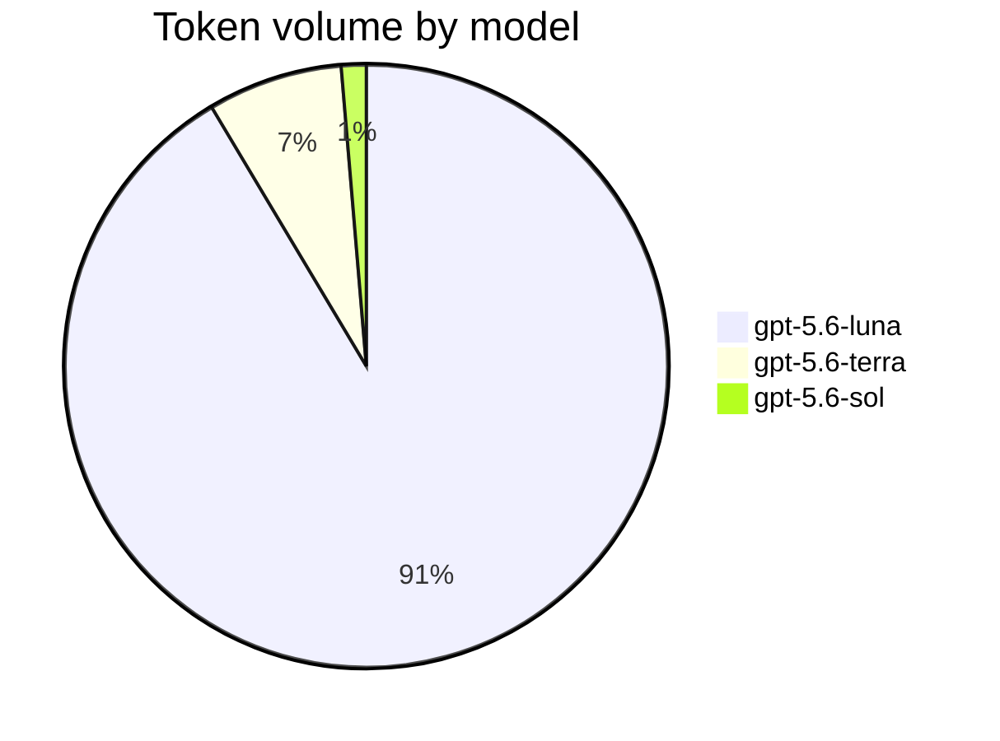
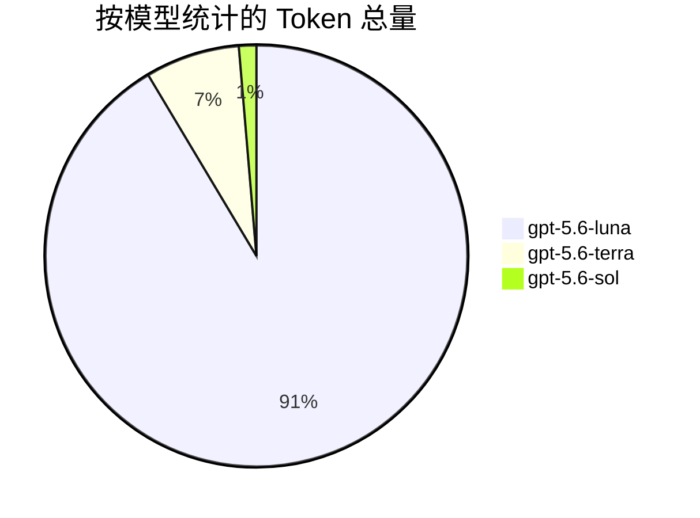

[![zread](https://img.shields.io/badge/Ask_Zread-_.svg?style=for-the-badge&color=00b0aa&labelColor=000000&logo=data%3Aimage%2Fsvg%2Bxml%3Bbase64%2CPHN2ZyB3aWR0aD0iMTYiIGhlaWdodD0iMTYiIHZpZXdCb3g9IjAgMCAxNiAxNiIgZmlsbD0ibm9uZSIgeG1sbnM9Imh0dHA6Ly93d3cudzMub3JnLzIwMDAvc3ZnIj4KPHBhdGggZD0iTTQuOTYxNTYgMS42MDAxSDIuMjQxNTZDMS44ODgxIDEuNjAwMSAxLjYwMTU2IDEuODg2NjQgMS42MDE1NiAyLjI0MDFWNC45NjAxQzEuNjAxNTYgNS4zMTM1NiAxLjg4ODEgNS42MDAxIDIuMjQxNTYgNS42MDAxSDQuOTYxNTZDNS4zMTUwMiA1LjYwMDEgNS42MDE1NiA1LjMxMzU2IDUuNjAxNTYgNC45NjAxVjIuMjQwMUM1LjYwMTU2IDEuODg2NjQgNS4zMTUwMiAxLjYwMDEgNC45NjE1NiAxLjYwMDFaIiBmaWxsPSIjZmZmIi8%2BCjxwYXRoIGQ9Ik00Ljk2MTU2IDEwLjM5OTlIMi4yNDE1NkMxLjg4ODEgMTAuMzk5OSAxLjYwMTU2IDEwLjY4NjQgMS42MDE1NiAxMS4wMzk5VjEzLjc1OTlDMS42MDE1NiAxNC4xMTM0IDEuODg4MSAxNC4zOTk5IDIuMjQxNTYgMTQuMzk5OUg0Ljk2MTU2QzUuMzE1MDIgMTQuMzk5OSA1LjYwMTU2IDE0LjExMzQgNS42MDE1NiAxMy43NTk5VjExLjAzOTlDMS42MDE1NiAxMC42ODY0IDUuMzE1MDIgMTAuMzk5OSA0Ljk2MTU2IDEwLjMzkOTlaIiBmaWxsPSIjZmZmIi8%2BCjxwYXRoIGQ9Ik0xMy43NTg0IDEuNjAwMUgxMS4wMzg0QzEwLjY4NSAxLjYwMDEgMTAuMzk4NCAxLjg4NjY0IDEwLjM5ODQgMi4yNDAxVjQuOTYwMUMxMC4zOTg0IDUuMzEzNTYgMTAuNjg1IDUuNjAwMSAxMS4wMzg0IDUuNjAwMUgxMy43NTg0QzE0LjExMTkgNS42MDAxIDE0LjM5ODQgNS4zMTM1NiAxNC4zOTg0IDQuOTYwMVYyLjI0MDFDMTQuMzk4NCAxLjg4NjY0IDE0LjExMTkgMS42MDAxIDEzLjc1ODQgMS42MDAxWiIgZmlsbD0iI2ZmZiIvPgo8cGF0aCBkPSJNNCAxMkwxMiA0TDQgMTJaIiBmaWxsPSIjZmZmIi8%2BCjxwYXRoIGQ9Ik00IDEyTDEyIDQiIHN0cm9rZT0iI2ZmZiIgc3Ryb2tlLXdpZHRoPSIxLjUiIHN0cm9rZS1saW5lY2FwPSJyb3VuZCIvPgo8L3N2Zz4K&logoColor=ffffff)](https://zread.ai/GhostXia/lean-dev-router)

# Lean Dev Router

## English

Lean Dev Router is a general theory for coordinating and escalating multi-agent software development work. It assigns planning, implementation, diagnosis, and validation to agents with different responsibilities and cost levels, escalating only when necessary.

I currently use Codex, so this repository uses GPT model identifiers as concrete examples. The routing theory is not tied to Codex or GPT and can be adapted to other agent runtimes and models.

For further token savings, this router can be combined with projects such as [Caveman](https://github.com/juliusbrussee/caveman), which reduce unnecessary verbosity in engineering workflows. Lean Dev Router reduces unnecessary agent calls and handoff context; Caveman reduces unnecessary prose in agent responses. Together, they can help maximize token efficiency while preserving the technical content that matters. This project currently does not plan to duplicate response-compression features already provided by such projects.

Because the subagents use explicitly selected models and follow detailed work assignments, the main conversation can often use Luna High or an even lower-cost model. One Sol coordinator handles complex planning and cross-task coordination when needed; the main conversation remains the user-facing control surface and mechanical fallback relay.

### Handoff protocol

All three roles use one compact, machine-readable handoff protocol:

```text
PROTOCOL: lean-dev-router/v1
AGENT: luna_worker | terra_auditor | sol_planner
STATUS: PASS | BLOCKED | ESCALATE
FAILURE: none | scope | verification | dependency | ambiguity | major-decision
EVIDENCE:
- path: relative/path/to/file
  proof: short diff summary or `command` -> PASS/FAIL
NEXT: parent | luna_worker | terra_auditor | sol_planner | none
SUMMARY: one concise sentence
```

`EVIDENCE` must bind repository claims to a concrete path and a short diff summary or command result. `PASS` means the current stage is complete; `BLOCKED` means required information, authority, or dependency is unavailable; `ESCALATE` means another role must act. The parent should not infer success from an incomplete handoff.

### User decision gate

Sol may decide reversible technical trade-offs that preserve the fixed objective, scope, acceptance criteria, and user-authorized policy. Sol must return decisions about objectives, direction, philosophy, product priority, explicit user intent, or irreversible and material commitments to the user through the parent session.

For such a decision, Sol returns `STATUS: BLOCKED`, `FAILURE: major-decision`, and `NEXT: parent`, with up to three viable options, decisive trade-offs, affected paths, one recommendation, and a single question for the user. The protocol intentionally does not add `NEXT: user`: the route is `sol_planner → parent → user`. After the answer, an existing Sol coordinator resumes its worker routing; the standalone fast path returns directly to Luna when all constraints are fixed.

### Codex execution mode

Native Codex subagents are the default. Send a clear bounded task directly to one Luna. For complex, ambiguous, or decomposable work, start exactly one Sol coordinator and let it partition, dispatch, wait for, and consolidate multiple Luna and Terra workers. Independent read, implementation, test, and review tasks may run in parallel; parallel Luna writers require separate worktrees or isolated branches.

Before a dependent or write handoff, verify that the intended Agent loaded, its model and reasoning effort are honored, and its first result follows `lean-dev-router/v1`. If Sol cannot spawn nested workers, the parent session acts only as a mechanical relay: it executes Sol's exact worker manifest and returns compact results to the same Sol for routing and consolidation. If native spawning is entirely unavailable, use independent Codex sessions with the same manifest.

When available, check `codex --version` before relying on native routing. In the Codex CLI, use `/agent` to inspect agent threads. If the client cannot start or expose the expected native workflow, use the fallback instead of silently substituting the default agent or model.

The native Codex background-agent UI is part of the native subagent workflow. Unrelated background processes or independent sessions are fallback mechanisms, not equivalent parent-child routing. See the [official Codex subagents documentation](https://learn.chatgpt.com/docs/agent-configuration/subagents) for current client and custom-agent behavior.

### Single-Sol worker scheduling

Use one Sol coordinator for each routed task by default. Sol chooses the number and mix of Luna and Terra workers from task size, volume, independence, dependency depth, and risk. It assigns bounded work, manages ordering and concurrency, waits for workers, verifies coverage, and consolidates their compact results. Luna and Terra never create additional agents or expand their own assignments. Use multiple Sol coordinators only when the user explicitly requests them, and give each Sol a non-overlapping orchestration scope.

| Mode | Requested cap | Priority |
| --- | ---: | --- |
| `token-first` | 3 | Minimize total agent overhead; default mode |
| `balanced` | 6 | Balance elapsed time and token overhead |
| `latency-first` | 10 | Minimize elapsed time for large independent workloads |

The cap covers Luna and Terra workers combined and is a routing heuristic, not a concurrency guarantee. For uniform item sets, start with `min(mode cap, ceil(items / 30))`, then adjust for complexity and risk. Keep dependent stages sequential and use disjoint waves if fewer workers start. Each worker receives an exact non-overlapping assignment; Sol verifies complete coverage and empty intersections. Parallel Luna tasks use one isolated worktree or branch per writer, with integration order decided by Sol.

For example, a latency-first audit of 282 merged pull requests uses one Sol coordinator and requests 10 Terra auditors with roughly 28–29 PRs each. Sol waits for every batch, verifies coverage, merges and deduplicates findings, and assigns high-risk or conflicting candidates to different Terra auditors for peer verification. A development task can similarly use multiple Luna workers in isolated worktrees, plus Terra workers for diagnosis or independent verification.

From personal experience, worktrees are recommended for batching independent tasks in parallel, especially when handling multiple pull requests at the same time. Give each task its own worktree and branch; avoid parallel worktrees for tightly dependent tasks or changes that must share the same working state.

Example routing chain:

```text
parent → one sol_planner ─┬→ luna_worker × N (isolated writes)
                          ├→ terra_auditor × N (audit/diagnosis)
                          └→ parent → user (user-owned decisions only)
```

### Contents

- `.agents/skills/lean-dev-router/`: the lightweight routing Skill.
- `agents/`: example Agent configuration files for `luna_worker`, `sol_planner`, and `terra_auditor`.
- `lean-dev-router-self-test-guide.md`: a controlled guide for measuring token savings, quality, and routing overhead on your own codebase.

### Install

For Codex, copy `.agents/skills/lean-dev-router/` to `~/.codex/skills/lean-dev-router/`, then copy the three files in `agents/` to `~/.codex/agents/`. Adapt the file format and model identifiers when using another runtime.

### Roles

- `sol_planner`: the single planner and orchestrator for complex tasks; scales, directs, and consolidates Luna/Terra workers, and returns user-owned decisions to the parent.
- `luna_worker`: bounded code, test, documentation, and configuration edits; multiple instances may run in parallel on isolated assignments.
- `terra_auditor`: code audit, technical diagnosis, and validation; escalate only when it cannot resolve the issue or a major decision is required.

Use `$lean-dev-router` when a task benefits from this routing policy. The Skill deliberately avoids invoking all agents by default and passes only compact handoff information.

### Final L3 test result

This is a recorded run of the L3 idempotent `POST /orders` task from [`lean-dev-router-l3-idempotent-orders-task.md`](lean-dev-router-l3-idempotent-orders-task.md), using a Luna High controller with `$lean-dev-router`. The figures below are transcribed from the supplied run screenshots; they are not a rerun in this repository.



| Model | Total tokens | Share | Input | Cached input (included in input) | Output | Events |
| --- | ---: | ---: | ---: | ---: | ---: | ---: |
| `gpt-5.6-luna` | 4,332,286 | 91.4% | 4,304,634 | 4,156,160 | 27,652 | 105 |
| `gpt-5.6-terra` | 342,648 | 7.2% | 335,741 | 301,312 | 6,907 | 11 |
| `gpt-5.6-sol` | 63,260 | 1.3% | 61,736 | 47,360 | 1,524 | 3 |
| **Total** | **4,738,194** | **100%** | **4,702,111** | **4,504,832** | **36,083** | **119** |

| Check | Recorded result |
| --- | --- |
| Duration | 12m 15s |
| Required behavior | First create `201`; replay `200`; conflicting key `409`; invalid input `400` |
| Concurrency | `RLock` protects same-key creation; one order is created for concurrent duplicate submissions |
| Tests | `python -m pytest tests/ -q` → **9 passed** |
| Scope | `git diff --stat` touches only `handlers/orders.py`, `service/order.py`, `service/store.py`, and `tests/test_order.py` |
| Baseline | `92ea4575174a163657005711057c97db97776845` |

The run used 405,908 tokens outside Luna, approximately 8.6% of the total. This is a routed-run cost profile, not a standalone savings rate; a savings claim still requires the same-packet Sol and direct-Luna control runs described in the self-test guide.

---

## 中文

Lean Dev Router 是一套用于协调和升级多 Agent 软件开发任务的通用理论。它让不同职责和成本层级的 Agent 分别负责规划、实施、诊断和验证，并且只在必要时向上升级。

我本人目前正在使用 Codex，因此本仓库使用 GPT 模型标识作为具体示例。这套路由理论不依赖 Codex 或 GPT，也可以迁移到其他 Agent 运行时和模型。

为了进一步节省 Token，可以配合 [Caveman](https://github.com/juliusbrussee/caveman) 这类减少工程中冗余表达的项目使用。Lean Dev Router 负责减少不必要的 Agent 调用和交接上下文，Caveman 负责减少 Agent 回复中的冗余措辞；两者结合可以在保留关键技术内容的同时，进一步提高 Token 使用效率。本项目目前暂不考虑重复实现这类项目已经提供的回复压缩功能。

由于各 Subagent 使用的模型明确、职责边界清晰且工作安排详细，主控对话通常可以使用 Luna High 或更低成本的模型。需要复杂规划和跨任务协调时，由一个 Sol 协调者处理；主控对话保留用户交互入口，并在必要时只做机械中继。

### 交接协议

三个角色统一使用以下紧凑、可解析的交接协议：

```text
PROTOCOL: lean-dev-router/v1
AGENT: luna_worker | terra_auditor | sol_planner
STATUS: PASS | BLOCKED | ESCALATE
FAILURE: none | scope | verification | dependency | ambiguity | major-decision
EVIDENCE:
- path: relative/path/to/file
  proof: short diff summary or `command` -> PASS/FAIL
NEXT: parent | luna_worker | terra_auditor | sol_planner | none
SUMMARY: one concise sentence
```

`EVIDENCE` 必须将仓库结论绑定到具体路径，并附简短 diff 摘要或命令结果。`PASS` 表示当前阶段完成；`BLOCKED` 表示缺少必要信息、权限或依赖；`ESCALATE` 表示需要其他角色继续处理。主控不得从缺少字段或证据的交接中自行推断成功。

### 用户决策门

Sol 可以裁定不改变既定目标、范围、验收标准和用户授权策略的可逆技术取舍。涉及目标、方向、理念、产品优先级、用户明确意图，或不可逆及重大的承诺时，Sol 必须通过父会话将决断权交还用户。

此时 Sol 返回 `STATUS: BLOCKED`、`FAILURE: major-decision`、`NEXT: parent`，并提供最多三个可行方案、关键取舍、受影响路径、一个推荐和需要询问用户的唯一问题。协议不增加 `NEXT: user`：正确路径是 `sol_planner → parent → user`。用户答复后，已有 Sol 协调者继续调度其 worker；独立快路径在约束完整确定时直接返回 Luna。

### Codex 执行方式

默认使用 Codex 原生 subagent。明确且边界清晰的任务直接交给一个 Luna；复杂、模糊或可拆分任务只启动一个 Sol 协调者，由其分解、分配、等待和归并多个 Luna/Terra。相互独立的读取、实现、测试和审查任务均可并行；并行 Luna 写入必须使用独立 worktree 或隔离分支。

在有依赖或写入的交接前，应确认目标 Agent 已加载、模型和思考强度生效，且首次结果遵循 `lean-dev-router/v1`。如果 Sol 无法嵌套启动 worker，父会话只做机械中继：严格执行 Sol 的 worker 清单，再将紧凑结果送回同一个 Sol 继续路由和归并。原生调用完全不可用时，使用相同清单启动独立 Codex session。

条件允许时，在依赖原生路由前检查 `codex --version`；在 Codex CLI 中使用 `/agent` 检查 Agent 线程。如果客户端无法启动或无法提供预期的原生流程，应使用 fallback，不要静默替换为默认 Agent 或模型。

Codex 原生后台 Agent 界面仍属于原生 subagent 流程；其他后台进程或独立 session 只能作为 fallback，不能视为等价的父子路由。当前 Codex 自定义 Agent 的行为以[官方 Subagents 文档](https://learn.chatgpt.com/docs/agent-configuration/subagents)为准。

### 单 Sol Worker 调度

每个路由任务默认只使用一个 Sol 协调者。Sol 根据任务规模、数量、独立性、依赖深度和风险决定 Luna/Terra 的数量及组合，负责通过独立 worktree 或明确隔离的任务范围进行分配、管理顺序与并发、等待 worker、检查覆盖范围并归并紧凑结果。Luna 和 Terra 不得自行创建 Agent 或扩大任务范围。只有用户明确要求时才使用多个 Sol，并必须为每个 Sol 分配互不重叠的调度范围。

| 模式 | 请求上限 | 优先目标 |
| --- | ---: | --- |
| `token-first` | 3 | 尽量减少 Agent 总开销；默认模式 |
| `balanced` | 6 | 平衡完成时间与 Token 开销 |
| `latency-first` | 10 | 缩短大型独立任务的完成时间 |

上限包含 Luna 与 Terra 的总数，属于调度启发式，不代表客户端或账户一定具备对应并发能力。对相对均匀的项目集合，先使用 `min(模式上限, ceil(项目数 / 30))`，再按复杂度和风险调整。有依赖的阶段保持串行；可用 worker 较少时使用互不重叠的波次。每个 worker 获得精确且不重叠的任务；Sol 确认覆盖完整且交集为空。并行 Luna 每个使用独立 worktree 或分支，合并顺序由 Sol 决定。

例如，对 282 个已合并 PR 进行 `latency-first` 审计时，使用一个 Sol 协调者，并请求 10 个 Terra，每个约 28–29 个 PR。Sol 等待所有批次、检查覆盖范围、归并去重发现，再将高风险或冲突候选交给不同的 Terra 交叉验证。开发任务同样可以让多个 Luna 在隔离 worktree 中并行实现，并搭配 Terra 诊断或独立验证。

个人经验：推荐使用 worktree 批量并行处理相互独立的任务，尤其适合同时推进多个 PR。为每个任务分配独立的 worktree 和分支；对于强依赖任务，或必须共享同一工作状态的改动，不建议并行处理。

示例调度链：

```text
parent → 单个 sol_planner ─┬→ luna_worker × N（隔离写入）
                            ├→ terra_auditor × N（审计/诊断）
                            └→ parent → user（仅限用户专属决策）
```

### 内容

- `.agents/skills/lean-dev-router/`：轻量级调度 Skill。
- `agents/`：`luna_worker`、`sol_planner` 和 `terra_auditor` 的示例 Agent 配置文件。
- `lean-dev-router-self-test-guide.md`：用于在自己的代码库中对比 Token 节省、质量和调度开销的受控测试指南。

### 安装

对于 Codex，将 `.agents/skills/lean-dev-router/` 复制到 `~/.codex/skills/lean-dev-router/`，再将 `agents/` 中的三个 TOML 文件复制到 `~/.codex/agents/`。使用其他运行时或模型时，应相应调整文件格式和模型标识。

### 角色

- `sol_planner`：复杂任务的唯一规划者和协调者；按需扩缩、指挥并归并 Luna/Terra，属于用户的决策交还父会话。
- `luna_worker`：负责边界明确的代码、测试、文档和配置改动；多个实例可以在隔离任务上并行运行。
- `terra_auditor`：负责代码审计、技术诊断和验证；只有无法解决问题或需要重大决策时才升级给 Sol。

### 最终 L3 测试结果

这是一次 L3 幂等 `POST /orders` 测试记录，测试题来自 [`lean-dev-router-l3-idempotent-orders-task.md`](lean-dev-router-l3-idempotent-orders-task.md)，使用 Luna High 主控与 `$lean-dev-router`。下列数据根据用户提供的测试截图整理，未在本仓库重新运行。



| 模型 | 总 token | 占比 | input | cached input（包含在 input 内） | output | 事件数 |
| --- | ---: | ---: | ---: | ---: | ---: | ---: |
| `gpt-5.6-luna` | 4,332,286 | 91.4% | 4,304,634 | 4,156,160 | 27,652 | 105 |
| `gpt-5.6-terra` | 342,648 | 7.2% | 335,741 | 301,312 | 6,907 | 11 |
| `gpt-5.6-sol` | 63,260 | 1.3% | 61,736 | 47,360 | 1,524 | 3 |
| **合计** | **4,738,194** | **100%** | **4,702,111** | **4,504,832** | **36,083** | **119** |

| 检查项 | 记录结果 |
| --- | --- |
| 耗时 | 12 分 15 秒 |
| 必需行为 | 首次创建 `201`；重放 `200`；冲突 key `409`；无效输入 `400` |
| 并发 | 使用 `RLock` 保护同 key 创建；并发重复提交最终只创建一个订单 |
| 测试 | `python -m pytest tests/ -q` → **9 passed** |
| 范围 | `git diff --stat` 仅涉及 `handlers/orders.py`、`service/order.py`、`service/store.py`、`tests/test_order.py` |
| 基线 | `92ea4575174a163657005711057c97db97776845` |

本次运行中，Luna 之外的模型合计消耗 405,908 tokens，约占总量 8.6%。这表示本次调度运行的成本构成，不等同于独立的节省率；若要得出节省结论，仍需按照测试指南使用相同题包进行 Direct Sol 和 Direct Luna 对照测试。

当任务适合采用这套路由策略时，可以使用 `$lean-dev-router`。该 Skill 不会默认调用全部 Agent，只传递精简的交接信息。
